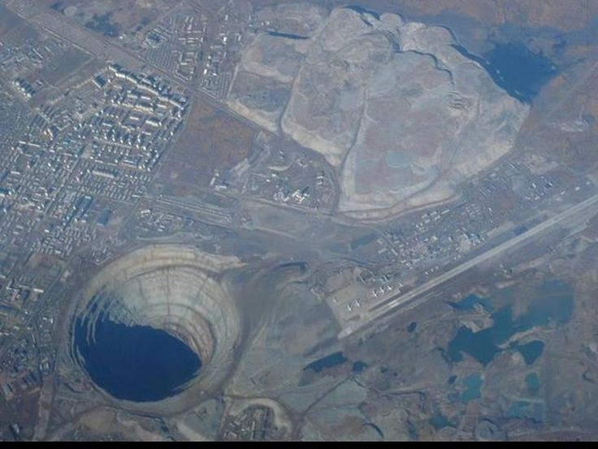

.. _introduction_index:

Introdução à Geofísica
======================

Neste capítulo apresentamos alguns fatos relevantes da história da geofísica, num contexto global do nosso planeta, seguimos o livro de 
:cite:`Ribeiro2018`, onde aspectos da sismologia, gravimetria, geomagnetismo e geotermia são apresentados.

A geofísica é uma das disciplinas das Ciências da Terra, ou seja, uma das ciências que se ocupam em estudar o planeta Terra (e por extensão outros corpos do Sistema Solar), 
em seus diferentes aspectos.

De uma forma muito esquemática, a Terra pode ser dividida em dois ambientes muito distintos: de um lado a superfície. onde a civilização humana se desenvolveu, e a atmosfera acima dela, e de outro lado o interior do planeta. O ambiente externo é diretamente acessível à observação e, por isto, é mais bem conhecido. O conhecimento acumulado sobre a superfície da Terra e a sua atmosfera permitiu a definição de disciplinas, ou áreas de estudo, distintas entre si, mas muito integradas, como a geologia, a meteorologia, a geografia, a oceanografia e a aeronomia, também chamada de geofísica externa, porque estuda as camadas superiores da atmosfera, particularmente suas características fisioquímicas. O ambiente interno, com a exceção de uma camada muito superfícial à qual se pode ter acesso muito localizado e limitado através de grutas naturais, minas e poços profundos, só pode ser investigado por meios de métodos indiretos. Ainda assim, o conhecimento acumulado permitiu a definição de disciplinas distintas e integradas como, além da geologia, a geoquímica e a geofísica.

A geofísica, tanto externa quanta a que se ocupa do interior da Terra, é a disciplina que investiga o planeta através de métodos físicos - conforme o próprio nome indica, ainda que de forma genérica. O objetivo da geofísica é o estudo da estrutura, da dinâmica e da evolução ao longo do tempo da Terra e, desde o início da era espacial na década de 60, dos demais corpos planetários do Sistema Solar.

.. sidebar:: Sinclinal

        .. figure:: ./images/Fig_01.01.png
            :align: center
            :figwidth: 100 %
            :name: fig_sinclinal

            Sinclinal simétrica.

        .. figure:: ./images/Fig_01.02.png
            :align: center
            :figwidth: 100 %
            :name: fig_falha

            Sinclinal com falha.

        .. figure:: ./images/Fig_01.03.png
            :align: center
            :figwidth: 100 %
            :name: fig_intrusao
            
            Sinclinal com intrusão.
            
        .. figure:: ./images/Fig_01.01.png
            :align: center
            :figwidth: 100 %
            :name: fig_sal
            
            Sinclinal com domo de sal.
            
O grande diferencial da geofísica para a geologia, é que ela pode ser usada para fazer observações sobre a subsuperfície usando medições tomadas (geralmente) na superfície. Na verdade, geofísica é o único ramo de as ciências da terra que podem verdadeiramente "olhar" para o interior da Terra, ou seja, detectar remotamente a presença de corpos e estruturas enterrados. Em contraste, geologia só pode inferi-los. Por exemplo, para as expostas dobras sinclinal da :numref:`fig_sinclinal`, podemos inferir vários cenários da subsuperfície, como uma falha :numref:`fig_falha`, uma intrusão como ilustra a :numref:`fig_intrusao` ou mesmo a presença de um domo salino, :numref:`fig_sal`.

Essas estruturas que a priori não poderiam ser inferidas apenas por amostras e estudo na superfície podem ser detectado por medições geofísicas apropriadas na superfície. Portanto, a geofísica é capaz de adicionar a terceira dimensão, profundidade, de uma forma que geologia tradicional muitas vezes não pode. Os poços podem, em princípio, fornecer  informações detalhadas sobre o subsolo, mas eles são caros e, estritamente, fornecem informações apenas sobre as rochas imediatamente ao redor do furo, a estrutura da rocha distante do poço poderia ser diferente e quase sempre é devido a grande heterogeneidade da geologia. Em contraste, levantamentos geofísicos muitas vezes fornecem informações menos precisas, mas ao longo de um volume muito maior de rocha. A perfuração também é limitada em quão profundo ele pode alcançar; o furo mais profundo (Península de Kola, no noroeste da Rússia) é inferior a 13 kilometros, (:numref:`fig_kola`), ou cerca de 1/500 da profundidade para o centro da Terra, enquanto geofísica pode sondar o todo o volume da Terra (e também explorar rochas ao redor de um poço).

	
	Super poço na penísula de Kola, na Rússia

**Conteúdo:**

.. toctree::
    :maxdepth: 2

    geofisica

