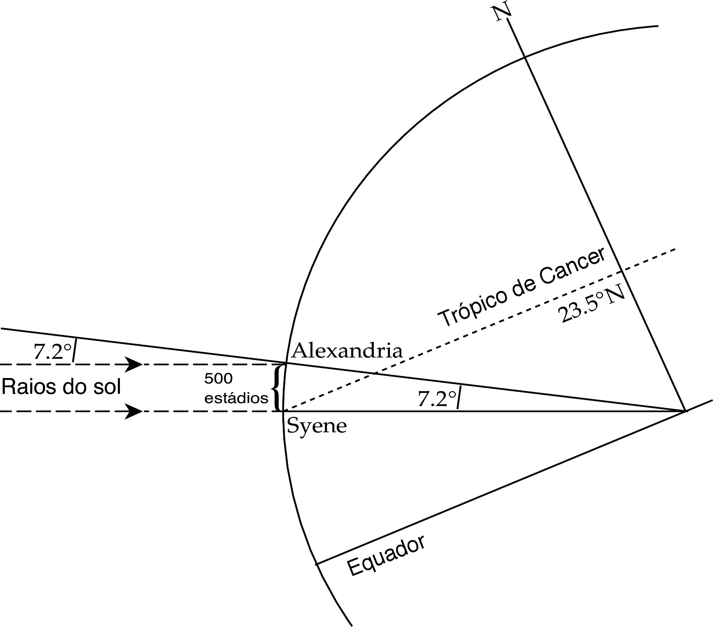
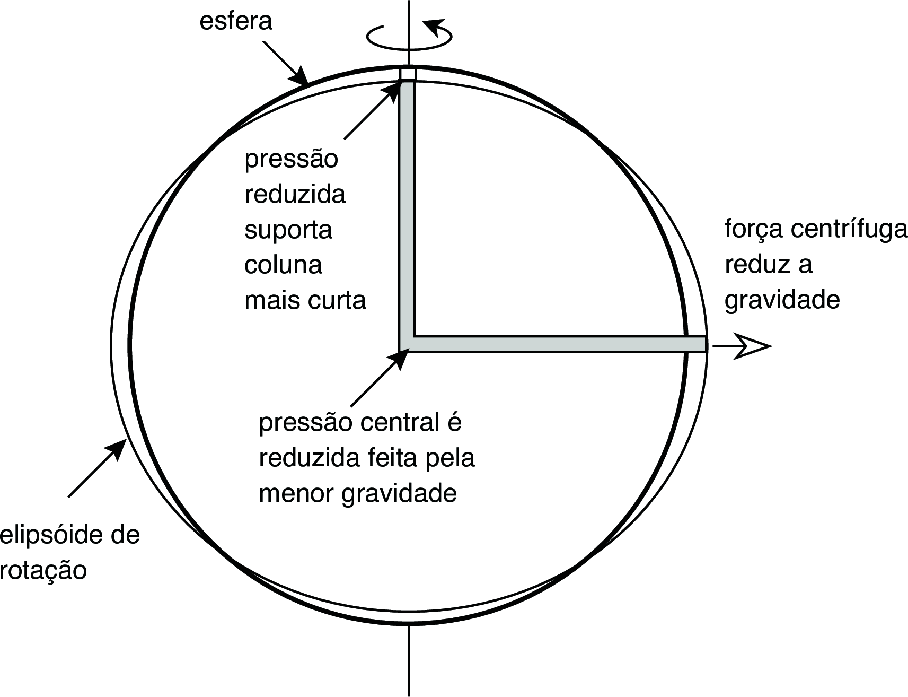
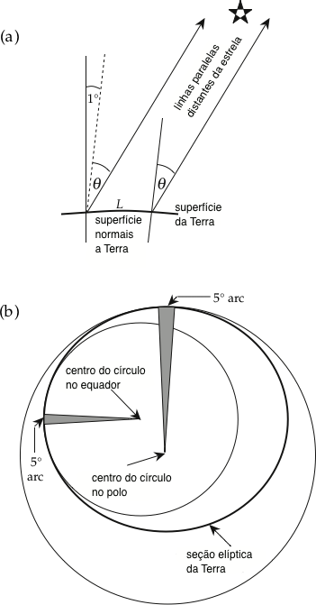

.. _grav_index:

Gravidade a Fígura da Terra
===========================
Neste capítulo seguimos o livro de :cite:`lowrie_2007`, apresentaremos o conceito de gravidade, anomalias gravimétricas, 
isostasia e reologia que são importantes tanto na geofísica global quanto na geofísica aplicada aos métodos gravimétricos.

O Tamanho da Terra
------------------

A primeira estimativa cientificamente sólida do tamanho do esfera terrestre foi feita por Eratóstenes (275-195 AC), que era o bibliotecário-chefe em Alexandria, uma colônia grega no Egito durante o terceiro século AC. Eratóstenes tinha dito que na cidade de Syene (moderna Assuão - Egito) raios do meio-dia do sol no dia de verão brilhou verticalmente e foram capazes de iluminar os fundos dos poços, enquanto no mesmo dia em Alexandria, sombras foram lançadas. Eratóstenes observou que no solstício de verão os raios do sol faziam um ângulo de um quinquagésimo de um círculo :math:`(360^\circ/50=7.2^\circ)` com a vertical em Alexandria, como ilustra a :numref:`fig_raio`.

	
	O método usado por Eratóstenes (275-195 AC) para estimar a circunferência da Terra usando a diferença de 
	:math:`7.2^\circ` em altitude do Raios de Sol em Alexandria e Syene.
	
	
Eratóstenes acreditava que Syene e Alexandria estavam num mesmo meridiano. Na verdade, eles estão ligeiramente deslocados; suas coordenadas geográficas são :math:`24^\circ`:math:`5'` N :math:`32^\circ` :math:`56'` E e :math:`31^\circ` :math:`13'` N :math:`29^\circ` :math:`55'` E. Syene
está na verdade sobre meio grau ao norte do trópico de Câncer. Eratóstenes sabia que a distância aproximada de Alexandria para Syene foi de 5000 estádios, possivelmente estimado por viajantes do número de dias (“10 dias de camelo”) levados para viajar entre as duas cidades. A partir dessas observações Eratóstenes estimou que a circunferência do esfera global é de 250.000 estádios. O estádio grego era o comprimento (cerca de 185 m) da pista de corrida em forma de U que as corridas e outros eventos esportivos foram realizados. A Estimativa de Eratóstenes da circunferência da Terra equivale a 46.250 km, cerca de 15% superior ao valor moderno de 40.030 km.

As estimativas do comprimento de um grau de meridiano foram feita no oitavo século DC, durante a dinastia Tang na China, e no nono século DC por astrônomos árabes na Mesopotâmia. Pouco progresso foi feito na Europa até o início do século XVII. Em 1662, a Royal Society foi fundada em Londres e em 1666 a Académie Royale des Sciences foi fundada em Paris. Ambas as organizações forneceu apoio e impulso à revolução científica. A invenção do telescópio permitiu levantamento geodésicas mais precisas. Em 1671, um astrônomo francês, Jean Picard (1620–1682), completou um levantamento preciso por triangulação do comprimento de um grau de arco meridiano. Doa seus resultados, o raio da Terra foi calculado em 6372 km, notavelmente perto do valor moderno de 6371 km.

Forma da Terra
--------------

Em 1672, outro astrônomo francês, Jean Richer, foi enviado por Louis XIV para fazer observações astronômicas sobre o ilha equatorial de Caiena. Ele descobriu que um pêndulo de relógio de precisão, que havia sido ajustado em Paris precisamente para bater em segundos, estava perdendo cerca de dois e meio minutos por dia, ou seja, o seu período foi agora demasiado longo. O erro foi muito grande para ser explicado pela imprecisão do instrumento. A observação despertou muito interesse e especulação, mas só foi explicado cerca de 15 anos mais tarde por Sir Isaac Newton em termos de suas leis de gravitação universal e movimento.

Newton argumentou que a forma da Terra em rotação deve ser a de um elipsoide oblato; comparado a uma esfera, deve ser um pouco achatado nos polo e protuberante para fora em torno do equador. Essa inferência foi feita em bases lógicas. Suponha que a Terra não gira e que os furos podem ser feitos para o seu centro ao longo do eixo de rotação e ao longo de um raio equatorial (:numref:`fig_forma`). E se esses orifícios são preenchidos com água, a pressão hidrostática no centro da Terra sustenta colunas de água iguais ao longo cada raio. No entanto, a rotação da Terra causa um força centrífuga no equador, mas não tem efeito sobre o eixo de rotação. No equador, a força centrífuga externa da rotação se opõe à atração gravitacional interna e puxa a coluna de água para fora. Ao mesmo tempo, reduz a pressão hidrostática produzida pela coluna de água no centro da Terra. A pressão central reduzida é incapaz de suportar a altura da coluna de água ao longo do raio polar, que diminui. Assim, se a Terra fosse uma esfera hidrostática, a forma da Terra em rotação deve ser um elipsoide oblato de revolução. Newton assumiu a densidade da Terra seja constante e calculado que o aplainamento deve ser de cerca de 1:230 (cerca de 0,5%). Isso é um pouco maior do que o achatamento real da Terra, que é cerca de 1:298 (aproximadamente 0,3%).

	
	O argumento de Newton de que a forma da Terra em rotação deveria ser achatada nos poloss e protuberante no equador foi baseado em equilíbrio hidrostático entre colunas de pressão polar e equatorial.
	
O aumento no período do pêndulo de Richer poderia agora ser explicado. Caiena estava perto do equador onde o raio maior colocou o observador mais longe do centro de atração gravitacional, e o aumento distância do eixo de rotação resultou em uma força centrífuga oposta. Esses dois efeitos resultaram em menor valor de gravidade em Caiena do que em Paris, onde o relógio havia sido calibrado.

Não houve a prova direta da interpretação de Newton. Uma corolário de sua interpretação foi que o arco do grau do meridiano deve subtender uma distância maior em regiões polares do que perto do equador (:numref:`fig_elipse`). No início do século XVIII profissionais em geodésia franceses estenderam a padronização do meridiano de fronteira a fronteira do país e encontrou um intrigante resultado. Em contraste com a previsão de Newton, o grau do arco meridiano diminuiu para o norte. A interpretação francesa era que a forma da Terra era um elipsoide prolato, alongada nos polos e estreitada no equador, como o forma de uma bola rugby. Uma grande controvérsia científica surgiu entre os “niveladores” e os “alongadores”.

	(a) O comprimento de um grau de arco meridiano é encontrado pela medida da distância entre dois pontos que estão a um grau de distância no mesmo 
	meridiano. (b) O raio de curvatura maior no plano aplanado polar dá uma maior distância do arco do que é encontrado no equador onde o raio de curvatura é menor.

Para determinar se a forma da Terra era oblata ou prolate, a Académie Royale des Sciences patrocinou dois expedições científicas. Em 1736-1737 uma equipe de cientistas medido o comprimento de um grau de arco meridiano na Lapónia, perto do Círculo Ártico. Eles encontraram um comprimento sensivelmente mais longo que o grau de meridiano medido Picard perto de Paris. De 1735 a 1743 uma segunda parte de cientistas mediram o comprimento de mais de 3 graus de arco meridiano no Peru, perto do equador. Seus resultados mostraram que o grau de latitude equatorial era mais curto do que o grau de meridiano em Paris. Ambas as partes confirmaram convincentemente a previsão de Newton que a forma da Terra é a de um elipsoide oblato.

A forma elipsoidal da Terra resultante de sua rotação tem consequências importantes, não só para o variação com a latitude da gravidade na superfície da Terra, mas também para a taxa de rotação da Terra e a orientação do seu eixo de rotação. Estes são modificados por torques que surgem das atrações gravitacionais do Sol, Lua e planetas na forma elipsoidal.

Uma representação da forma da Terra mais próxima da realidade pode ser obervado na :numref:`fig_GRACE_globe` que apresenta a visualização de um modelo gravitacional criada com dados de garvidade do projeto Gravity Recovery and Climate Experiment (GRACE) da NASA e mostra variações no campo gravitacional da Terra. A gravidade é determinada pela massa. A massa da Terra não é distribuída igualmente e também muda com o tempo.

As cores nesta imagem representam as anomalias da gravidade medidas pelo GRACE. Pode-se definir a gravidade padrão como o valor da gravidade para uma Terra "idealizada" perfeitamente lisa, e a "anomalia" da gravidade é uma medida de como a gravidade real se desvia desse padrão. O vermelho mostra as áreas onde a gravidade é mais forte do que o valor normal, e o azul revela as áreas onde a gravidade é mais fraca. O vermelho representa uma aceleração de :math:`5~10^{-4}~m/s^2`, o azul representa :math:`-5~10^{-4}~m/s^2`, para ver a legenda das cores.

.. figure:: ./images/GRACE_globe_animation.gif
	:align: center
	:figwidth: 50 %
	:name: fig_GRACE_globe
	
	Distribuiçao da aceleração graviatcional na Terra.
	
