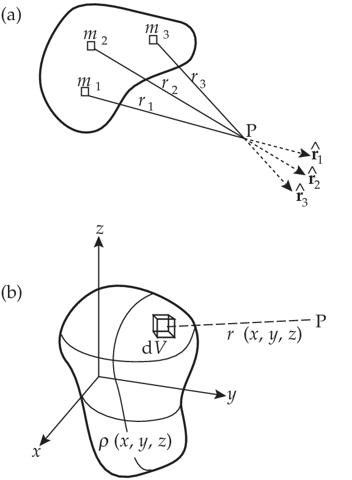
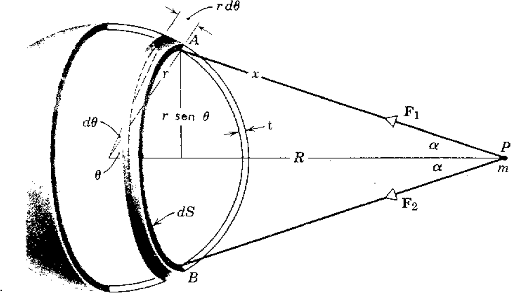
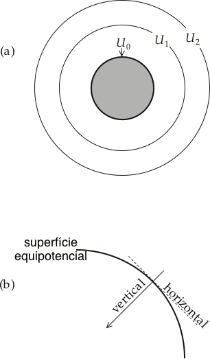

.. _gravitacao_index:

Gravitação
==========

A Lei Universal da Gravitação
-----------------------------

Um corpo de massa :math:`m` em movimento possui um momento de inércia :math:`(m\mathbf{v})`. Para mudarmos este movimento é necessário aplicarmos uma força 
:math:`\mathbf{F}` a este corpo. A segunda lei de movimento de Newton estabelece que a taxa de variação do momento de uma massa é proporcional a força que atua sobre ela, e acontece na direção da força. Para o caso de massas constantes esta lei serve como definição de força :math:`\mathbf{F}` em termos da aceleração 
:math:`(\mathbf{a})` dada e pela massa :math:`(m)`:

.. math::
    \mathbf{F} = \frac{d}{dt} (m\mathbf{v}) = m \frac{d\mathbf{v}}{dt}= m \mathbf{a} 
    :label: newton_lei

A unidade de força no sistema SI é o Newton (N). Ela é definida como sendo a força que dá a uma massa de um quilograma, uma aceleração de :math:`1\, \mathrm{m}/\mathrm{s}^2`.

Nós conhecemos a célebre observação de Newton da maçã em queda, a qual ele relacionou com a atração gravitacional que a Terra exercia sobre a maçã. Entretanto, a genialidade de Newton foi reconhecer que o campo gravitacional que faz com que a maçã caia é a mesma que mantém a Lua em órbita em torno da Terra e que mantém os planetas girando ao redor do Sol. Newton deduziu que a atração gravitacional :math:`\mathbf{F}` entre duas partículas de massas :math:`m` e :math:`M`, separadas pela distância :math:`r`, é proporcional ao produto destas massas e inversamente proporcional ao quadrado da distância entre elas:

.. math::
    \mathbf{F} = -G\frac{m M}{r^2} \hat{\mathbf{r}}
    :label: grav_lei

Onde :math:`\hat{\mathbf{r}}` é o vetor unitário na direção da coordenada :math:`r`, direcionada para fora do centro de referência da massa :math:`M`. O sinal negativo indica que a força :math:`\mathbf{F}` age na direção oposta, em direção da massa :math:`M` (:numref:`geometria_lei_grav`). A constante :math:`G` é denominada de Constante da Gravitação Universal.

.. raw:: html

    <iframe src="https://phet.colorado.edu/sims/html/gravity-force-lab/latest/gravity-force-lab_en.html" width="700" height="600" scrolling="no" allowfullscreen></iframe>

Na época de Newton não havia como determinar a constante :math:`G`. O método a ser seguido, seria determinar a força exercida entre duas massas no laboratório. A determinação experimental de :math:`G`, é extremamente difícil e foi conseguida somente depois de mais de um século após a formulação de Newton, por Lord Charles Cavendish, em 1798. Depois de uma série de medidas apuradas da força de atração entre duas esferas, Cavendish determinou o valor de :math:`G = 6,754 \times 10^{-11} \mathrm{m}^3 \mathrm{kg}^{-1}\mathrm{s}^{-2}`. Um valor atual da constante (:cite:`RevModPhys.77.1`) :math:`G` é :math:`6,674210 \times 10^{-11} \mathrm{m}^3 \mathrm{kg}^{-1}\mathrm{s}^{-2}`.

.. sidebar:: Geometria da atração gravitacional

    .. figure:: ./images/Fig_02.04.png
        :align: center
        :figwidth: 100 %
        :name: geometria_lei_grav
        
        Geometria da atração gravitacional sobre (a) dois pontos de massa, (b) um ponto de massa fora de uma esfera, (c) um ponto de massa sobre a superfície de uma esfera.
        
Energia Potencial e Trabalho
----------------------------

A lei da conservação de energia significa que a energia total a em um sistema fechado é constante. Duas formas de energia devem ser consideradas aqui. A primeira é a energia potencial, em que um objeto tem em virtude de sua posição relativa a origem de uma força. A segunda é o trabalho feito contra a ação da força durante a uma variação de posição

Por exemplo, quando a maçã de Newton está na árvore, ela tem uma energia potencial mais alta do que quando está no chão. Ela cai devido à força descendente da gravidade e perde energia potencial ao fazê-lo. Para calcular a variação da energia potencial precisamos elevar a maçã à sua posição original. Isso requer que apliquemos uma força igual e oposta à atração gravitacional na maçã e, devido esta força ser movida ao longo da distância em que a  maçã caiu, nós temos que gastar energia em forma de trabalho. E se a altura original da maçã acima do nível do solo era :math:`h` e o valor da força exercida pela gravidade na maçã é :math:`F`, a força que devemos aplicar para colocá-lo de volta é :math:`(-F)`. Assumindo que :math:`F` é constante através da curta distância de sua queda, o trabalho despendido é :math:`(-F) h`. Este é o aumento da energia potencial da maçã, quando está na árvore.

Mas geralmente, se a força constante :math:`F` se move através uma pequena distância :math:`dr` na mesma direção que a força, o trabalho feito é :math:`dW= Fdr` e a variação na energia potencial :math:`dE_p` é dada por

.. math::
    dE_p = -dW = -Fdr.
    :label: energia_pot

No caso mais geral, temos que considerar os movimentos e forças que têm componentes ao longo de três ortogonal eixos. O deslocamento :math:`dr` e a força 
:math:`F` não precisam ser paralelos um ao outro. Temos que tratar :math:`F` e :math:`dr` como vetores. Em coordenadas cartesianas, o vetor de deslocamento 
:math:`dr` tem componentes :math:`(dx, dy, dz)` e a força tem componentes :math:`(F_x, F_y, F_z)` ao longo de cada um dos respectivos eixos. O trabalho realizado pela componente :math:`x` da força quando é deslocado ao longo do eixo :math:`x` é :math:`F_xdx`, e existem expressões similares para os deslocamentos ao longo dos outros eixos. A variação na energia potencial :math:`dE_p` é agora dada por

.. math::
    dE_p = -dW = -(F_xdx +F_ydy+F_zdz).
    :label: energia_pot2

A expressão entre parênteses é chamada de produto escalar dos vetores :math:`\mathbf{F}` e :math:`d\mathbf{r}` definida pela expressão :math:`Fdr\cos{\theta}`, onde :math:`\theta` é o ângulo entre os dois vetores.

Aceleração Gravitacional
------------------------

Na física, o campo de uma força é frequentemente mais importante que a magnitude absoluta da força. O campo é definido como a força exercida em uma unidade de material. Por exemplo, o campo elétrico de um corpo carregado em uma determinada posição é a força que ele exerce em uma unidade de carga elétrica naquele local. O **campo gravitacional** na vizinhança de uma massa de atração é a força que exerce sobre uma massa unitária. A Equação :eq:`newton_lei` mostra que isso é equivalente ao vetor de aceleração.

Em aplicações geofísicas, estamos preocupados com acelerações, e não com forças. Comparando Equação :eq:`newton_lei` e Equação :eq:`grav_lei` obtemos a aceleração gravitacional :math:`a_G` da massa :math:`m` devido à atração da massa :math:`M`

.. math::
    a_G = -G\frac{M}{r^2} \hat{\mathbf{r}}.
    :label: acel_G

A unidade de aceleração do SI é o :math:`(\mathrm{m}\mathrm{s}^{-2})`; esta unidade é impraticável para uso em geofísica. No agora superado sistema c.g.s.  a unidade de aceleração é de :math:`(\mathrm{cm}\,\mathrm{s}^{-2})`, que é chamado de gal em reconhecimento das contribuições de Galileo. As pequenas mudanças na aceleração da gravidade causadas pelas estruturas geológicas são medidas em milésimos desta unidade, ou seja, em miligramas (mgal). Até recentemente, anomalias de gravidade devido a estruturas geológicas foram pesquisadas com instrumentos de campo com precisão de cerca de um décimo de miligal, o que foi chamado de **unidade de gravidade**. Instrumentos modernos são capazes de medir diferenças de gravidade para um milionésimo de gal, ou microgal :math:`(\mu gal)`, que está se tornando a unidade prática de investigações de gravidade. O valor da gravidade na superfície da Terra é de cerca de :math:`9.8\, \mathrm{m}\mathrm{s}^{-2}`, e assim a sensibilidade das medições modernas da gravidade é de cerca de 1 parte em :math:`10^9`.

Uma idéia das acelerações gravitacionais entre o sistema Sol, Terra, Lua e um satélite é apresentado pela simulação a seguir 

.. raw:: html

    <iframe src="https://phet.colorado.edu/sims/html/gravity-and-orbits/latest/gravity-and-orbits_en.html" width="700" height="600" scrolling="no" allowfullscreen></iframe>

Potencial Gravitacional
-----------------------
O potencial gravitacional é a energia potencial de uma massa unitária em um campo de atração gravitacional. Seja o potencial ser denotado pelo símbolo :math:`U_G`. A energia potencial :math:`E_p` de uma massa :math:`m` em um campo gravitacional é, portanto, igual a :math:`(mU_G)`. Assim, uma variação na energia potencial :math:`(dEp)` é igual a :math:`(m dU_G)`. A Equação :eq:`energia_pot` se torna, usando a Equação :eq:`newton_lei`

.. math::
    mdU_G = -Fdr = -ma_Gdr.
    :label: potencial1

Rearranjando esta equação conseguimos a aceleração gravitacional

.. math::
    a_G = -\frac{dU_G}{dr} \hat{\mathbf{r}}.
    :label: potencial2

Em geral, a aceleração é um vetor tridimensional. Se estivermos usando coordenadas cartesianas :math:`(x, y, z)`, a aceleração terá componentes :math:`(a_x, a_y, a_z)`. Estes podem ser determinados separadamente, calculando as derivadas do potencial em relação as coordenadas :math:`x`, :math:`y` e :math:`z`:

.. math::
    a_x = -\frac{\partial U_G}{\partial x}, \quad a_y = -\frac{\partial U_G}{\partial y},\quad a_z = -\frac{\partial U_G}{\partial z}
    :label: acel

Usando as Equações :eq:`energia_pot` e :eq:`potencial2` temos que o potencial gravitacional de um ponto de massa :math:`M`:

.. math::
    \frac{dU_G}{dr} = G\frac{M}{r^2},
    :label: potencialdr
    
que tem como solução

.. math::
    U_G = -G\frac{M}{r}.
    :label: potencialU

Para as três componentes cartesianas a equação :eq:`acel` pode ser escrita como

.. math::
    a_G = -\nabla U_G

que é uma generalização da equação :eq:`potencial2` onde :math:`\nabla` é operador diferencial *del* ou *nabla* definido como
:math:`\nabla=\frac{\partial}{\partial x}\hat{\mathbf{x}} + \frac{\partial}{\partial y}\hat{\mathbf{y}} + \frac{\partial}{\partial z}\hat{\mathbf{z}}`, 
ou seja, a aceleração gravitacional é o negativo do gradiente do potencial.

Aceleração e Potencial de uma Distribuição de Massa
---------------------------------------------------

Até agora, consideramos apenas a aceleração gravitacional e o potencial de massas pontuais. Um corpo sólido pode ser considerado composto de numerosas partículas pequenas, cada uma das quais exerce uma atração gravitacional em um ponto externo :math:`P` (:numref:`distribuicao` a). Para calcular a aceleração gravitacional do objeto no ponto :math:`P`, devemos formar uma soma vetorial das contribuições das partículas individuais discretas. Cada contribuição tem uma direção diferente. Supondo que :math:`m_i` seja a massa da partícula na distância :math:`r_i` de :math:`P`, isso dá uma expressão como

.. math::
    a_G = -G\frac{m_1}{r_1^2}\hat{\mathbf{r}}_1 -G\frac{m_2}{r_2^2}\hat{\mathbf{r}}_2 - \cdots .
    :label: acel_Gi
    
Dependendo da forma do sólido, esta soma vetorial pode ser bastante complicada.

Uma solução alternativa para o problema é encontra primeiro o potencial gravitacional, e então diferenciá-lo como na Equação :eq:`acel_G` para conseguir a aceleração. A expressão para o potencial em :math:`P` é

.. math::
    U_G = -G\frac{m_1}{r_1} -G\frac{m_2}{r_2} - \cdots .
    :label: PotencialG

Esta é uma soma escalar, que é usualmente mais simples do que calcular uma soma vetorial. Mais comumente, o objeto não é representado como um conjunto de partículas discretas, 
mas por uma distribuição de massa contínua. 
No entanto, podemos subdividir o volume em elementos discretos; se a densidade da matéria em cada volume é conhecida, a massa do elemento pequeno pode ser calculada e sua contribuição 
para o potencial no ponto externo :math:`P` 
pode ser determinada. Ao integrar o volume do corpo, seu potencial gravitacional em :math:`P` pode ser calculado. Então se considerarmos um ponto no corpo com coordenadas 
:math:`(x, y, z)` de densidade igual a :math:`\rho(x, y, z)` a uma distância :math:`P` igual a :math:`r(x,y,z)` como na :numref:`distribuicao` b. O potencial gravitacional do corpo em :math:`P` é:

    
    (a) Cada pequena partícula de um corpo sólido exerce uma atração gravitacional em uma diferente 
    direção num ponto externo :math:`P`, (b) Computação do potencial gravitacional de uma distribuição de massa contínua.
        
.. math::
    U_G = -G \iiint \frac{\rho(x,y,z)}{r(x,y,z)} dxdydz.
    :label: PotencialG_int

A integração fornece o potencial gravitacional e a aceleração em pontos dentro e fora de uma esfera sólida oca ou homogênea. 
Os valores fora de uma esfera na distância :math:`r` de seu centro são os mesmos como se toda a massa 
:math:`E` da esfera estivesse concentrada em seu centro (:numref:`geometria_lei_grav` b):

.. math::
    U_G = -G \frac{E}{r}
    :label: Pot_E

.. math::
    \mathbf{a}_G = -G \frac{E}{r^2} \hat{\mathbf{r}}.
    :label: acel_E

Massa e Densidade Média da Terra
--------------------------------

As equações :eq:`Pot_E` e :eq:`acel_E` são válidas em todos os lugares fora de uma esfera, incluindo em sua superfície onde a distância do centro de massa é igual à média do raio 
:math:`R` (:numref:`geometria_lei_grav` c). Se considerarmos a Terra como uma primeira aproximação de uma esfera com massa :math:`E` e raio :math:`R`, podemos estimar sua massa reescrevendo a Equação :eq:`acel_E` como uma equação escalar na forma

.. math::
    E= \frac{R^2a_G}{G}
    :label: massa_E

A aceleração gravitacional na superfície da Terra é apenas ligeiramente diferente da gravidade média, cerca de :math:`9,81\; \mathrm{m}\mathrm{s}^{-2}`, o raio da Terra é 
:math:`6371~\mathrm{km}`, 
e a constante gravitacional é :math:`6.674\times 10^{-11}\; \text{m}^3\mathrm{kg}^{-1}\mathrm{s}^{-2}`. A massa da Terra será :math:`5.974\times 10^{24}\; \mathrm{kg}`. 
Este grande número não é tão significativo quanto sua densidade média, que pode ser calculada dividindo a massa da Terra pelo seu volume :math:`(\tfrac{4}{3}\pi R^3)`. 
A densidade média é de :math:`5515\; \mathrm{kg}\,\mathrm{m}^{-3}`, que é aproximadamente o dobro da densidade das rochas crustais. Isso indica que o interior da Terra não é homogêneo e implica que a densidade deve aumentar com a profundidade na Terra.

O cálculo do potencial é muito mais simples do que o cálculo da aceleração gravitacional, como se mostra no exemplo a seguir adaptado do livro de 
:cite:`Halliday1987`.

Exemplo: Aceleração e potencial para uma esfera homogênea
*********************************************************

Considere uma casca esférica de densidade constante, cuja espessura :math:`t` seja pequena em relação ao raio :math:`r` (:numref:`casca`). Desejamos calcular a aceleração gravitacional exercida numa partícula de massa :math:`m` num ponto :math:`P`.

    
    Atração gravitacional da seção :math:`dS` de uma casca esférica sobre uma partícula :math:`m`.

**Solução:**

Tomemos como elemento de massa da camada uma faixa circular de área :math:`dS`, com comprimento :math:`2\pi(r\sin{\theta})`, largura :math:`rd\theta` e espessura :math:`t`. 
Seu volume será :math:`dV` dado por:

.. math::
    dV= 2\pi t r^2\sin\theta d\theta.

Sendo :math:`\rho` a densidade da casca, sua massa será 

.. math::
    dM= \rho dV=  2\pi t \rho r^2\sin\theta d\theta.

Devido a simetria do problema, vemos que a  aceleração exercida por :math:`dM`, num ponto :math:`A` sobre a partícula de massa :math:`m` localizada em :math:`P` 
é horizontal tendo o valor igual

.. math::
    d\mathbf{a}_G &= -G\frac{dM}{x^2}\cos\alpha\; \hat{\mathbf{R}}\\
    &=-2\pi G t \rho r^2\frac{\sin\theta d\theta}{x^2}\cos\alpha\; \hat{\mathbf{R}}

em que :math:`\hat{\mathbf{R}}` é um vetor unitário na direção da linha que une o centro da esfera :math:`M` com o ponto :math:`P`.

As variáveis :math:`x`, :math:`\alpha` e :math:`\theta` estão relacionadas. A figura mostra que

.. math::
    \cos\alpha = \frac{R-r\cos\theta}{x}

e, como, pela lei dos cossenos

.. math::
    x^2=R^2+r^2-2Rr\cos\theta

tem-se

.. math::
    r\cos\theta = \frac{R^2+r^2-x^2}{2R}

Assim, diferenciando a equação  :math:`x^2=R^2+r^2-2Rr\cos\theta`, temos :math:`2xdx=2Rr\sin{\theta}d\theta`, ou seja 

.. math::
    \sin\theta d\theta=\frac{x}{Rr}dx.

Eliminando :math:`\theta` e :math:`\alpha` das equações obtemos

.. math::
    d\mathbf{a}_G = -\frac{\pi Gt\rho r}{R^2}\left(\frac{R^2-r^2}{x^2}+1\right)\; \hat{\mathbf{R}},

que é aceleração exercida pela faixa circular :math:`dS` sobre a partícula :math:`m`. Deve-se agora considerar cada elemento de massa da casca e 
somar todas as faixas circulares da casca: então temos uma integração sobre a casca em relação a :math:`x`, cujos os valores vão do mínimo 
:math:`R-r` ao máximo :math:`R+r`.

Tendo em conta que

.. math::
    \int_{R-r}^{R+r}\left(\frac{R^2-r^2}{x^2}+1\right) dx =4r

obtêm-se a aceleração resultante

.. math::
    \mathbf{a}_G = -\int_{R-r}^{R+r}d\mathbf{a}_G = G\frac{(4\pi r^2\rho t)}{R^2} \; \hat{\mathbf{R}}

Como a massa da esfera é dada por :math:`M=\rho V`, onde :math:`V` é o volume da esfera que é igual ao produto da área de sua superfície 
:math:`4\pi r^2` pela sua espessura :math:`t`, temos que :math:`V=4\pi r^2t`. Assim, a aceleração gravitacional é dada como: 

.. math::
    \mathbf{a}_G = -G\frac{M}{R^2}\; \hat{\mathbf{R}}

Por outro lado, podemos obter o mesmo valor a partir do cálculo do potencial gravitacional, uma vez que :math:`\mathbf{a}_G= -\nabla U_G`. 
Para fazer isso, conforme :cite:`fowler1990solid`, vimos que o volume circular da casca da :numref:`casca` é dada por

.. math::
    \rho t (2\pi r^2 \sin{\theta})(d\theta).
    
Devido cada ponto de uma faixa da casca circular ter a mesma distância :math:`x` do ponto :math:`P`, a Equação :eq:`potencialU` determina o potencial em :math:`P` 
feito por essa faixa como

.. math::
    -\frac{\rho t 2\pi r^2 \sin{\theta}d\theta}{x}.

Novamente, aplicando a lei dos cossenos temos que :math:`x^2=R^2+r^2-2Rr\cos\theta`. O potencial em toda  esfera pode ser avaliado a partir da Equação :eq:`PotencialG_int` 
integrando o potencial da casca em todo o volume

.. math::
    U_G = -G\rho t 2\pi r^2 \int_V\frac{\sin{\theta}d\theta}{(R^2+r^2-2Rr\cos\theta)^{1/2}} dV.

Diferenciando implicitamente a expressão  :math:`x^2=R^2+r^2-2Rr\cos\theta` em relação a :math:`x` e :math:`\theta`, obtemos :math:`xdx=Rr\sin{\theta}d\theta`, assim teremos

.. math::
    U_G = -G\rho t 2\pi r^2 \int_V\frac{dx}{R r} dV.

Para calcular a integral é necessário considerar dua situações: (i) quando :math:`P` estiver fora da esfera :math:`(R>r)` e (ii), quando :math:`P` está dentro da esfera 
:math:`(R<r)`. Quando o ponto :math:`P` é externo os limites de integração são :math:`R-r` e :math:`R+r` e o potencial em :math:`P` é

.. math::
    U_G = -G\rho t 2\pi r^2\left[\frac{x}{Rr}\right]_{R-r}^{R+r}=-G\frac{\rho 4\pi t r^2}{R} = -G\frac{M}{R}.

A aceleração gravitacional é dada por:

.. math::
    \mathbf{a}_G = - \frac{\partial U_G}{\partial R} = -G\frac{M}{R^2}\;\hat{\mathbf{R}}.

Quando o ponto :math:`P` está dentro da esfera, o limites de integração são :math:`r-R` e :math:`r+R`, neste caso o potencial é

.. math::
    U_G = -G\rho t 2\pi r^2\left[\frac{x}{Rr}\right]_{r-R}^{r+R}=-G \rho 4\pi t r.

que é constante e independe da posição :math:`P` dentro da esfera. A aceleração gravitacional, sendo o negativo do gradiente do potencial, é desta forma nula dentro da esfera.

Superfícies Equipotenciais
--------------------------

Uma superfície equipotencial é aquela em que o potencial é constante. Para uma esfera com determinada massa, o potencial gravitacional (Equação :eq:`acel_E`) 
varia apenas com a distância :math:`r` de seu centro. Um certo valor do potencial, digamos :math:`U_1`, é realizado a uma distância radial constante :math:`r_1`. 
Assim, a superfície equipotencial na qual o potencial tem o valor :math:`U_1` é uma esfera com raio :math:`r_1`; uma superfície equipotencial diferente :math:`U_2` 
é a esfera com raio :math:`r_2`. As superfícies equipotenciais da massa esférica original formam um conjunto de esferas concêntricas (:numref:`equipotencial` a), 
uma das quais (por exemplo, :math:`U_0`) coincide com a superfície da massa esférica. Esta superfície equipotencial particular descreve a figura da massa esférica.

Por definição, nenhuma mudança no potencial ocorre (e nenhum trabalho é feito) em mover de um ponto para outro em uma superfície equipotencial. 
O trabalho feito por uma força :math:`F` em um deslocamento :math:`dr` é :math:`Fdr\cos{\theta}` que é zero quando :math:`\cos{\theta}` é zero, isto é, quando o ângulo 
:math:`\theta` entre o deslocamento e a força é :math:`90^\circ`. Se nenhum trabalho é feito em um movimento ao longo de uma superfície equipotencial gravitacional, 
a força e aceleração do campo gravitacional devem agir perpendicular à superfície. Esta normal à superfície equipotencial define a direção *vertical* ou da linha de prumo 
(:numref:`equipotencial` b). O plano tangencial à superfície equipotencial em um ponto define a *horizontal* nesse ponto.

    
    (a) Superfícies equipotenciais de uma massa de forma esférica forma 
    um conjunto de esferas concêntricas, (b) A normal da superície equipotencial 
    define a direção vertical; o plano tangente define a horizontal.

