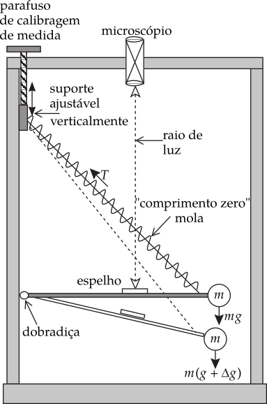
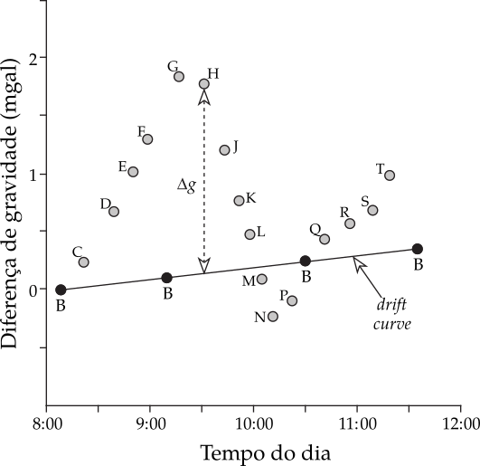

Anomalias Gravitaconais
-----------------------

Introdução
==========

O valor médio da gravidade na superfície da Terra é de aproximadamente :math:`9.80\,\mathrm{m}\mathrm{s}^{-2}` ou :math:`980000\,\mathrm{mgal}`. A rotação e o achatamento da Terra fazem com que a gravidade aumente em aproximadamente :math:`5300\,\mathrm{mgal}`, do equador ao polo, o que é uma variação de apenas cerca de :math:`0.5\%`. Assim, as medidas de gravidade são de dois tipos. A primeira corresponde à determinação da magnitude absoluta da gravidade em qualquer lugar; e a segunda consiste em medir a mudança na gravidade de um lugar para outro. Em estudos geofísicos, especialmente na prospecção por gravidade, é necessário medir com precisão as variações na gravidade causadas por estruturas subterrâneas. Estes requerem uma sensibilidade instrumental da ordem de :math:`0.01\,\mathrm{mgal}`. É muito difícil projetar um instrumento para medir o valor absoluto da gravidade que tem essa alta precisão e que também é portátil o suficiente para ser usado facilmente em diferentes lugares. O levantamento de gravidade é geralmente realizado com um instrumento portátil chamado gravímetro, que determina a variação da gravidade em relação a um ou mais locais de referência. Em levantamentos de gravidade, as variações relativas determinadas com um gravímetro podem ser convertidas em valores absolutos por calibração com medições absolutas feitas em estações selecionadas.

Medidas da Gravidade
====================

Medida Absoluta da Gravidade
^^^^^^^^^^^^^^^^^^^^^^^^^^^^

O método clássico de medir a gravidade é com um pêndulo. Um pêndulo simples consiste em um peso suspenso no fim de uma fina fibra. O pêndulo composto (ou reversível), descrito pela primeira vez por Henry Kater em 1818, permite medições mais exatas. Consiste numa haste de metal duro ou de quartzo, com cerca de :math:`50\,\mathrm{cm}` de comprimento, à qual está ligada uma massa móvel. Perto de cada extremidade da haste é fixado um pivô, que consiste em uma ponta de faca de quartzo apoiada em um plano de quartzo plano. O período do pêndulo é medido por oscilações sobre um dos pivôs. O pêndulo é então invertido e seu período em torno do outro pivô é determinado. A posição da massa móvel é ajustada até os períodos próximos dos dois pivôs serem iguais. A distância :math:`L` entre os pivôs é então medida com precisão. O período do instrumento é dado por

.. math::
    T=2 \pi \sqrt{\frac{I}{m g h}}=2 \pi \sqrt{\frac{L}{g}}
    :label: eq:0234

onde :math:`I` é o momento de inércia do pêndulo em torno de um pivô, :math:`h` é a distância do centro de massa do pivô, e :math:`m` é a massa do pêndulo. Conhecer o comprimento :math:`L` do método de Kater evita o conhecimento de :math:`I`, :math:`m` e :math:`h`.

A sensibilidade do pêndulo composto é encontrada diferenciando a (Equação :eq:`eq:0234`). Isto dá

.. math::
    \frac{\Delta g}{g}=-2 \frac{\Delta T}{T}
    :label:  eq:0235

Para obter uma sensibilidade de cerca de :math:`1\,\mathrm{mgal}` é necessário determinar o período com uma precisão de cerca de :math:`0.5 \,\mathrm{s}`. Isto pode ser conseguido facilmente hoje com relógios atômicos precisos. O pêndulo composto foi o principal instrumento para a prospecção da gravidade nos anos de 1930, quando o tempo das oscilações era precisamente mais difícil. Era necessário marcar com a maior precisão possível um número muito grande de oscilações. Como resultado, uma única medição de gravidade demorava cerca de meia hora.

O desempenho do instrumento foi prejudicado por vários fatores. A reação inercial do invólucro à massa oscilante do pêndulo foi compensada pela montagem de dois pêndulos no mesmo chassi e balançando-os em fase oposta. A resistência do ar foi reduzida 

alojando a montagem do pêndulo em uma câmara a vácuo controlada termostaticamente. A fricção no pivô era minimizado pelo fio de faca de quartzo e plano, mas devido ao desnível menor, a borda de contato não foi exatamente repetida se o conjunto foi montado em um local diferente, que afetou a confiabilidade das medições. o aparelho era volumoso, mas foi usado até a década de 1950 como o método principal de fazer medições de gravidade absoluta.

Medidas Relativas da Gravidade: o Gravímetro
^^^^^^^^^^^^^^^^^^^^^^^^^^^^^^^^^^^^^^^^^^^^ 

Em princípio, um medidor de gravidade ou gravímetro é um balança de equilíbrio muito sensível. Os primeiros gravímetros foram baseados na aplicação direta da lei de Hooke. Uma massa $m$ suspendida por uma mola de comprimento $s_0$ faz com que ela se estique até um novo comprimento $s$. A extensão, ou mudança de comprimento, da mola é proporcional à força restauradora da mola e, portanto, ao valor da gravidade, de acordo com:

.. math::
    F=m g=-k\left(s-s_{0}\right).
    :label:  eq:0236
    
onde :math:`k` é a constante elástica da mola. O gravímetro é calibrado em um local conhecido. Se a gravidade é diferente em outro local, a extensão das molas variam e a partir disso, a mudança na gravidade pode ser calculada.

Este tipo de gravímetro, baseado diretamente na lei de Hooke, é chamado de tipo estável. Ele foi substituído por do tipos instáveis ou astatizados, que são construídos de maneira que uma força adicional atua na mesma direção que a gravidade e se opõe à força restauradora da mola. o instrumento está então em um estado de equilíbrio instável. este condição é realizada através do projeto da mola. E se o comprimento natural :math:`s_0` pode ser tão menor quanto possível, idealmente zero, Equação :eq:`eq:0236` mostra que a força restauradora é então proporcional ao comprimento físico da mola em vez de sua extensão. A *mola de comprimento zero*, primeiro introduzida no gravímetro LaCoste-Romberg, é agora um elemento comum em gravímetros modernos. A mola é geralmente do tipo helicoidal. Quando uma mola helicoidal é esticada, a fibra da mola é torcida; a torção total ao longo do comprimento da fibra é igual à extensão do mola como um todo. Durante a fabricação de uma mola helicoidal de comprimento zero é dado uma torção extra, de modo que a sua a tendência é desenrolar. Um aumento na gravidade estica o mola contra sua força restauradora, e a extensão é aumentada pela pré-tensão interna.

    Princípio de operação de um gravímetro do tipo instavel (astatizado).

A operação de um gravímetro é ilustrada na Figura (:numref:`gravimetro`). Uma massa é suportada por uma barra horizontal na qual um espelho é anexado. A posição da haste é observada com um feixe de luz refletido em um microscópio. Se a gravidade mudar, a mola de comprimento zero é prolongada ou encurtada e a posição da haste é alterada, o que desvia o raio de luz. O princípio de deflexão nula é utilizado. Um parafuso de ajuste altera a posição da fixação superior da mola, o que altera sua tensão e restaura a haste para sua posição horizontal original, conforme detectado pelo raio de luz e pelo microscópio. As voltas do parafuso de ajuste são calibradas em unidades da mudança de gravidade, geralmente em :math:`\mathrm{mgal}`.

O gravímetro é leve, robusto e portátil. Após o nivelamento inicial do instrumento, uma medição precisa de uma diferença de gravidade pode ser feita em poucos minutos. o o gravímetro tem uma sensibilidade de cerca de :math:`0.01\, \mathrm{mgal}` :math:`(10\,\mu\mathrm{gal})`. Essa alta sensibilidade faz com que seja suscetível a pequenas alterações em suas próprias propriedades.

Levantamentos Gravimétricos
^^^^^^^^^^^^^^^^^^^^^^^^^^^

Se um gravímetro for montado em um determinado local e monitorado por cerca de uma hora, as leituras repetidas variam suavemente com o tempo. As alterações somam vários centésimos de mgal. O *desvio instrumental* é parcialmente devida a mudanças induzidas termicamente nas propriedades elásticas da mola gravimétrica, que são minimizadas ao alojar os elementos críticos em uma câmara evacuada. Além disso, as propriedades elásticas da mola não são perfeitas, mas fluem lentamente com o tempo. O efeito é pequeno nos gravímetros modernos e pode ser compensado fazendo uma *correção de desvio (drift correction)*. Isto é obtido pela ocupação repetida de algumas estações de medição em intervalos durante o dia Figura :numref:`drift`.

    Compensação de leituras de gravidade para desvio instrumental. As estações de gravidade B – T são ocupadas 
    em sequência em tempos conhecidos. As medições repetidas na estação base B permitem que uma correção de 
    desvio seja feita nas leituras de gravidade nas outras estações.

Leituras de gravidade em outras estações são ajustadas por comparação com a curva de desvio. Para fazer esta correção, o tempo de cada medição deve ser anotado.

Durante o dia, enquanto as medições estão sendo feitas, o gravímetro está sujeito à atração de maré, incluindo o deslocamento vertical devido às marés orgânicas da Terra. A teoria das marés é bem conhecida e seu efeito dependente do tempo na gravidade pode ser calculado precisamente para qualquer lugar na Terra a qualquer momento. Novamente, a *correção das marés* requer que o tempo de cada medição seja conhecido. 

O objetivo do levantamento por gravidade é localizar e descrever estruturas subsuperficiais a partir dos efeitos de gravidade causados por suas densidades anômalas. Mais comumente, as medições gravimétricas são feitas em uma rede de estações, espaçadas de acordo com a finalidade da pesquisa. Em estudos ambientais, uma investigação detalhada de alta resolução da expressão gravitacional de uma pequena área requer pequenas distâncias de alguns metros entre as estações de medição. Em levantamentos de gravidade regional, usados para a definição de estruturas ocultas de interesse comercial prospectivo, a distância entre as estações pode ser de vários quilômetros. Se a área pesquisada não for muito grande, um local adequado é selecionado como estação base (ou local de referência), e as diferenças de gravidade entre os locais pesquisados e este site são medidas. Em um levantamento de gravidade em escala nacional, as diferenças de gravidade podem ser determinadas em relação a um local onde o valor absoluto da gravidade é conhecido.
