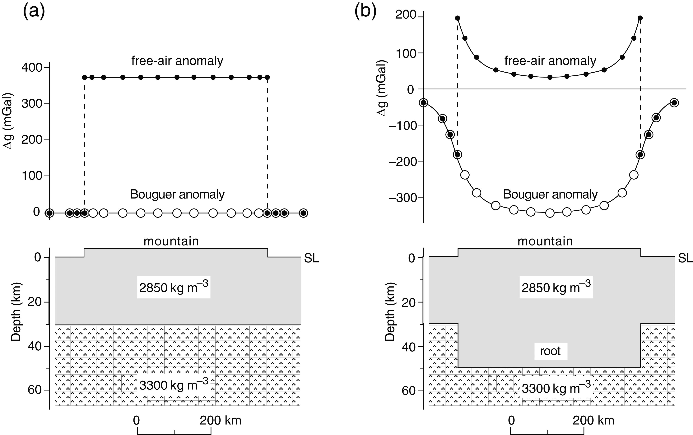

Anomalias Gravimétricas Ar Livre (free-air) e Bouger
----------------------------------------------------

Suponha que possamos medir a gravidade no elipsóide de referência. Se a distribuição da densidade dentro da Terra é homogênea, a gravidade medida deve concordar com a gravidade teórica dada pela fórmula da gravidade normal. As correções de gravidade descritas anteriormente compensam a situação usual de que o ponto de medição não está no elipsóide. Uma discrepância entre a gravidade medida corrigida e a gravidade teórica é chamada de anomalia gravitacional. Surge porque a densidade do interior da Terra não é homogênea como se supõe. Os tipos mais comuns de anomalia gravitacional são a *anomalia Bouguer e a anomalia do ar livre (free-air)*.

A anomalia gravimétrica Bouger :math:`\left(\Delta g_{B}\right)` é definida pela aplicação de todas as correcções descritas individualmente

.. math::
    \begin{align}
    \Delta g_{\mathrm{B}}=g_{\mathrm{m}}+\left(\Delta g_{\mathrm{FA}}-\Delta g_{\mathrm{BP}}+\Delta g_{\mathrm{T}}+\Delta g_{\mathrm{tidc}}\right)-g_{\mathrm{n}}.
    \end{align}
    :label: eq0248

Nesta fórmula, :math:`g_{\mathrm{m}}` e :math:`g_{\mathrm{n}}` são os valores de gravidade medida e gravidade normal; as correções entre parênteses são a correção de ar livre 
:math:`\left(\Delta g_{\mathrm{FA}}\right)`, correção da placa Bouguer :math:`\left(\Delta g_{\mathrm{BP}}\right)`, correção do terreno :math:`\left(\Delta g_{\mathrm{T}}\right)` e 
correção de maré :math:`\left(\Delta g_{\mathrm{tide}}\right)`.

A anomalia de ar livre :math:`\left(\Delta g_{\mathrm{F}}\right)` é definida aplicando-se apenas as correções de ar livre, terreno e maré à gravidade medida:

.. math::
    \begin{align}
    \Delta g_{\mathrm{F}}=g_{\mathrm{m}}+\left(\Delta g_{\mathrm{FA}}+\Delta g_{\mathrm{T}}+\Delta g_{\mathrm{tidc}}\right)-g_{\mathrm{n}}
    \end{align}
    :label: eq0249

As anomalias Bouguer e de ar livre na mesma estrutura podem parecer bem diferentes. Considere primeiro o bloco topográfico (representando uma cadeia de montanhas) mostrado na 
:numref:`anomalias` a. Para essa estrutura simples, negligenciamos as correções do terreno e das marés. A diferença entre a anomalia de Bouguer e a anomalia do ar livre surge da correção da placa de Bouguer. No cálculo da anomalia de Bouguer, a elevação simples da estação de medição é levada em conta juntamente com a correção de ar livre. A gravidade medida contém a atração da massa de terra acima do elipsóide, que é compensada com a correção da placa de Bouguer. A estrutura subterrânea não varia lateralmente, portanto a medida corrigida está de acordo com o valor teórico e a anomalia de Bouguer está em toda parte zero ao longo da cadeia montanhosa. Ao computar a anomalia de ar livre, somente a correção de ar livre é aplicada; a parte da gravidade medida devido à atração da massa de terra acima do elipsóide não é levada em consideração. Longe do bloco de montanha, as anomalias de Bouguer e de ar livre são iguais a zero. Sobre a montanha, a massa do bloco de montanha aumenta a gravidade medida em comparação com o valor de referência e resulta em uma anomalia de ar livre positiva em toda a cadeia montanhosa.

    
    Anomalias de ar livre e Bouguer em toda a cordilheira. Em (a) a montanha é modelada por um bloco totalmente suportado, 
    e em (b) a massa da montanha acima do nível do mar (SL) é compensada por uma raiz crustal menos densa, 
    que se projeta para baixo no manto mais denso.

De fato, dados sísmicos mostram que a crosta terrestre é geralmente muito mais espessa do que o normal sob uma cadeia de montanhas. Isso significa que um bloco de rochas crustais menos densas se projeta no manto mais denso (:numref:`anomalias` b). Depois de fazer as correções da placa de ar livre e da Bouguer, permanece uma anomalia de Bouguer devido a um bloco que representa a “zona das raízes” da cordilheira. Como isso é menos denso que o manto adjacente e subjacente, constitui um déficit de massa. A atração em um gravímetro nas estações em um perfil através da cordilheira será menor do que na Figura \@ref(fig:anomalias)a, então a medida corrigida será menor que o valor de referência. Uma anomalia Bouguer fortemente negativa é observada ao longo do perfil. A certa distância do bloco da montanha, as Bouguer e as anomalias de ar livre são iguais, mas elas não são mais zero, porque a anomalia de Bouguer agora contém o efeito da zona de raiz. Sobre o bloco de montanha, a anomalia de ar livre tem um deslocamento positivo constante da anomalia de Bouguer, como no exemplo anterior. Note que, embora a anomalia de ar livre seja positiva, ela cai para um valor muito baixo sobre o centro do bloco. Neste ponto, a atração da montanha é parcialmente cancelada pela falta de atração da zona de raiz menos densa.

