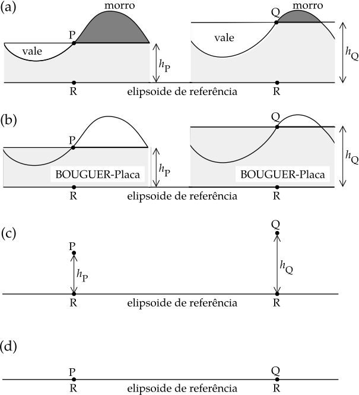
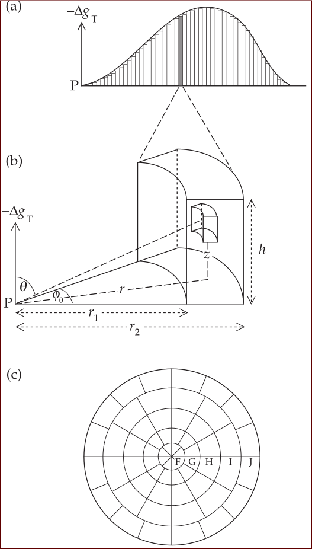

Correções de Medidas Gravimétricas
----------------------------------

Se o interior da Terra fosse uniforme, o valor da gravidade no elipsoide de referência internacional variaria com a latitude de acordo com a fórmula da gravidade normal 
(Equação :eq:`eq:0230`). Isso nos fornece um valor de referência para medições de gravidade. Na prática, não é possível medir a gravidade no elipsoide no local onde o valor de referência é conhecido. A elevação de uma estação de medição pode estar a centenas de metros acima ou abaixo do elipsoide. Além disso, a estação de gravidade pode ser cercada por montanhas e vales que perturbam a medição. Por exemplo, se P e Q representam estações de gravidade em diferentes altitudes em terrenos acidentados (:numref:`correcao` a). O valor teórico da gravidade é calculado nos pontos R no elipsoide de referência abaixo de P e Q. Assim, devemos corrigir a gravidade medida antes que ela possa ser comparada com o valor de referência.

O topo do morro adjacente às estações P e Q tem um centro de massa que fica mais alto do que a elevação da medição (:numref:`correcao` a). O gravímetro mede a gravidade na direção vertical, ao longo da linha de prumo local. A massa do topo da colina acima de P atrai o gravímetro e causa uma aceleração com um componente vertical para cima em P. A gravidade medida é reduzida pela presença do topo da colina; Para compensar isso, uma correção de terreno (ou topográfica) é calculada e adicionada à gravidade medida. Um efeito semelhante é observado em Q, mas o topo da colina acima de Q é menor e a correção de terreno correspondente é menor. Essas correções efetivamente nivelam a topografia para a mesma elevação da estação gravimétrica. A presença de um vale ao lado de cada estação de medição também requer uma correção do terreno. Neste caso, imaginemos que poderíamos encher o vale até o nível de cada estação com rochas da mesma densidade que está abaixo de P e Q. A atração para baixo no gravímetro seria aumentada, então a correção do terreno para um vale também deve ser adicionado à gravidade medida, tal como para uma colina. Remover os efeitos da topografia em torno de uma estação de gravidade requer a realização de correções de terreno positivas 
:math:`\left(\Delta g_{\mathrm{T}}\right)` para as colinas e vales.

Depois de nivelar a topografia, há agora uma camada fictícia uniforme de rocha com densidade $\rho$ entre a estação de gravidade e o elipsoide de referência 
(:numref:`correcao` b). A aceleração gravitacional dessa massa rochosa está incluída na medida da gravidade e deve ser removido antes que possamos comparar com a gravidade teórica. A camada é considerada como sendo um disco plano ou placa de espessura :math:`h_{\mathrm{P}}` ou :math:`h_{\mathrm{Q}}` em cada estação; é chamado o *placa Bouguer*. Sua aceleração gravitacional pode ser calculada para espessura e densidade conhecidas :math:`\rho`, e fornece uma *correção de placa Bouguer* :math:`\left(\Delta g_{\mathrm{BP}}\right)` que deve ser subtraída da gravidade medida, se a estação de gravidade estiver acima do nível do mar. Note que, se a estação de gravidade estiver abaixo do nível do mar, nós temos que preencher o espaço acima dela até o nível do mar com a rocha de densidade :math:`\rho`; isso requer aumentar a gravidade medida correspondentemente. A correção da placa de Bouguer :math:`\left(\Delta g_{\mathrm{BP}}\right)` é negativa se a estação estiver acima do nível do mar, mas positiva se estiver abaixo do nível do mar. Seu tamanho depende da densidade das rochas locais, mas normalmente equivale a cerca de :math:`0.1\,\mathrm{mgal}\, \mathrm{m}^{-1}`.

    Após (a) correções do terreno, (b) correção da placa Bouguer, e (c) correção do ar livre, as medidas de gravidade 
    nas estações P e Q podem ser comparadas com (d) a gravidade teórica em R no elipsoide de referência.

Finalmente, devemos compensar a gravidade medida para a elevação :math:`h_{\mathrm{P}}` ou :math:`h_{\mathrm{Q}}` da estação de gravidade acima do elipsoide (:numref:`correcao` c). 
A parte principal da gravidade é devida à atração gravitacional, que diminui proporcionalmente ao quadrado inverso da distância do centro da Terra. A gravidade medida em :math:`P` ou :math:`Q` é menor do que seria se medida no elipsoide em :math:`R`. Uma *correção de ar livre (free-air)* :math:`\left(\Delta g_{\mathrm{FA}}\right)` para a elevação da estação deve ser adicionada à gravidade medida. Esta correção ignora os efeitos do material entre os níveis de medição e referência, pois isso é considerado em :math:`\Delta g_{\mathrm{BP}}`. Observe que, se a estação de gravidade estivesse abaixo do nível do mar, a parte gravitacional da gravidade medida seria muito grande em comparação com o elipsoide de referência; precisaríamos subtrair 
:math:`\left(\Delta g_{\mathrm{FA}}\right)` neste caso. A correção de ar livre é positiva se a estação estiver acima do nível do mar, mas negativa se estiver abaixo do nível do mar (como pode ser o caso no Vale da Morte ou ao lado do Mar Morto). Isso equivale a cerca de 0.3 :math:`\mathrm{mgal}\, \mathrm{m}^{-1}`.

A correção de ar livre é sempre de sentido oposto à correção da placa de Bouguer. Por conveniência, os dois são frequentemente combinados em uma única correção de elevação, que equivale a cerca de 0.2 :math:`\mathrm{mgal}\, \mathrm{m}^{-1}`. Isto deve ser adicionado para as estações de gravidade acima do nível do mar e subtraído se a gravidade for medida abaixo do nível do mar. Além disso, uma correção de maré :math:`\left(\Delta g_{\text { tile }}\right)` deve ser feita e, se a gravidade for medida em um veículo em movimento, a correção de Eötvõs também é necessária.

Após a correção, a gravidade medida pode ser comparada com a gravidade teórica no elipsoide (:numref:`correcao` b). Note que o procedimento acima reduz a gravidade medida para a superfície do elipsoide. Em princípio, é igualmente válido corrigir a gravidade teórica do elipsoide para cima até o nível em que a medição foi feita. Este método é preferido em tipos mais avançados de análise de anomalias de gravidade, onde a possibilidade de uma massa anômala entre o elipsoide e a superfície do solo deve ser levada em conta.

Correções de Latitude
=====================

A gravidade teórica a uma determinada latitude é dada pela fórmula de gravidade normal (Equação :eq:`eq:0230`). Se a gravidade medida for um valor absoluto, a correção da latitude é feita subtraindo o valor previsto por esta fórmula. Muitas vezes, no entanto, o levantamento da gravidade é feito com um gravímetro, e a quantidade medida, :math:`g_m`, é a diferença de gravidade relativa a uma estação base. A gravidade de referência normal :math:`g_n` pode então ser substituída por uma correção de latitude, obtida pela diferenciação da 
Equação :eq:`eq:0230`:

.. math::
    \frac{\partial g_{n}}{\partial \lambda}=g_{e}\left(\beta_{1} \sin 2 \lambda+\beta_{2} \sin 4 \lambda\right)
    :label: eq:0237

Depois de converter :math:`\partial \lambda` de radianos em quilômetros e desprezar o termo :math:`\beta_2`, a correção de latitude :math:`\left(\Delta g_{\mathrm{lat}}\right)` é 0.8140 :math:`\sin 2 \lambda\, \mathrm{mgal}` por quilômetro de deslocamento norte-sul. Como a gravidade diminui em direção aos pólos, a correção para estações mais próximas do polo do que a estação base deve ser adicionada à gravidade medida.

Correção do Terreno
===================

A correção do terreno :math:`\left(\Delta g_{\mathrm{T}}\right)` para uma colina adjacente a uma estação de gravidade é calculada dividindo a colina em vários prismas verticais 
(:numref:`terreno` a). A contribuição de cada elemento vertical para a aceleração vertical no ponto de observação :math:`P` é calculada assumindo simetria cilíndrica sobre :math:`P`. 
A altura do prisma é :math:`h`, seus raios interno e externo são :math:`r_1` e :math:`r_2`, respectivamente, o ângulo subentendido em :math:`P` é :math:`\phi_0`, e a densidade da colina é 
:math:`\rho` (:numref:`terreno` b). Deixe os lados de um pequeno elemento cilíndrico serem :math:`dr`, :math:`dz` e :math:`r d\phi`; sua massa é :math:`dm= \rho r d\phi dr dz` e sua contribuição para a aceleração ascendente causada pelo prisma em P é

.. math::
    \Delta g=G \frac{\mathrm{d} m}{\left(r^{2}+z^{2}\right)} \cos \theta=G \frac{\rho r \mathrm{d} r \mathrm{d} z \mathrm{d} \phi}{\left(r^{2}+z^{2}\right)} \frac{z}{\sqrt{\left(r^{2}+z^{2}\right)}}.
    :label: eq:0238

Combinando e rearranjando termos e a ordem de integração, obtém-se a aceleração ascendente em :math:`P` devido ao prisma cilíndrico:

.. math::
    \Delta g_{\mathrm{T}}=G \rho \int_{\phi=0}^{\phi_{0}} \mathrm{d} \phi \int_{r=r_{1}}^{r_{2}}\left(\int_{z=0}^{h} \frac{z \mathrm{d} z}{\left(r^{2}+z^{2}\right)^{3 / 2}}\right) r \mathrm{d} r. 
    :label: eq:0239
    
A integração sobre :math:`\phi` dá :math:`\phi_0`; após integração adicional sobre :math:`z` conseguimos:

.. math::
    \Delta g_{T}=G \rho \phi_{0} \int_{r=r_{1}}^{r_{2}}\left(\frac{r}{\sqrt{\left(r^{2}+h^{2}\right)}}-1\right) \mathrm{d} r.
    :label: eq:0240
    
A integração sobre :math:`r` fornece a aceleração ascendente produzida em :math:`P` pelo cilindro:

.. math::
    \Delta g_{T}=G \rho \phi_{0}\left(\left(\sqrt{r^{2}+h^{2}}-r_{1}\right)-\left(\sqrt{r^{2}+h^{2}}-r_{2}\right)\right).
    :label: eq:0241

A direção de :math:`\Delta g_{\mathrm{T}}` na (:numref:`terreno` b) é para cima, oposta à gravidade; a correção do terreno correspondente deve ser adicionada à gravidade medida.

Na prática, as correções de terreno podem ser feitas usando um gráfico de terreno (:numref:`terreno` c) no qual círculos concêntricos e linhas radiais dividem a área ao redor da estação de gravidade em setores que possuem simetria radial como a seção transversal do elemento de um cilindro vertical. Na :numref:`terreno` b. Os raios interno e externo de cada setor correspondem a :math:`r_1` e :math:`r_2` e o ângulo subtendido pelo setor é :math:`\phi`. A correção do terreno para cada setor dentro de cada zona é pré-calculada usando a 
Equação :eq:`eq:0241` e tabulado. O gráfico é desenhado em uma folha transparente que é sobreposta em um mapa topográfico na mesma escala e centrada na estação de gravidade. A elevação média dentro de cada setor é estimada com a maior precisão possível, e a diferença de elevação (ou seja, :math:`h` na Equação :eq:`eq:0241`) do setor em relação à estação é calculada. Isso é multiplicado pelo fator de correção do setor para dar sua contribuição para a correção do terreno. Finalmente, a correção do terreno na estação gravitacional é obtida pela soma das contribuições de todos os setores. O procedimento deve ser repetido para cada estação de gravidade.

Quando o gráfico de terreno está centrado numa nova estação, o relevo topográfico médio dentro de cada setor muda e deve ser calculado de novo. Como resultado, as correções do terreno são demoradas e tediosas. Os efeitos mais importantes vêm da topografia mais próxima da estação. No entanto, as correções do terreno são geralmente necessárias se uma diferença topográfica dentro de um setor estiver a mais de 5% de sua distância da estação.

    
    As correções de terreno :math:`\Delta g_\mathrm{T}` são feitas (a) dividindo a topografia em elementos verticais, 
    (b) computando a correção para cada elemento cilíndrico de acordo com sua altura acima ou abaixo da estação de medição e 
    (c) somando as contribuições para todos os elementos ao redor a estação com o auxílio de uma sobreposição transparente em um mapa topográfico.

Correção Bouger (placa Bouger)
==============================

A correção da placa Bouguer :math:`\left(\Delta g_{\mathrm{BP}}\right)` compensa o efeito de uma camada de rocha cuja espessura corresponde à diferença de elevação entre os níveis de medição e referência. Isto é modelado por um disco sólido de densidade :math:`\rho` e  raio infinito centrado na estação gravitacional :math:`P`. A correção é computada por extensão do cálculo para a correção do terreno. Um prisma cilíndrico elementar é definido como na :numref:`terreno` b. Seja o ângulo :math:`\phi` subtendido pelo prisma aumentar para :math:`2\pi` e o raio interno diminuir para zero; o primeiro termo entre parênteses na Equação :eq:`eq:0241` reduz para :math:`h`. A aceleração gravitacional no centro de um disco sólido de raio :math:`r` é então

.. math::
    \Delta g_{\mathrm{T}}=2 \pi G \rho\left(h-\left(\sqrt{r^{2}+h^{2}}-r\right)\right).
    :label: eq:0242

Agora seja o raio :math:`r` do disco aumentar. O valor de :math:`h` torna-se gradualmente insignificante comparado a :math:`r`; no limite, quando :math:`r` é infinito, o segundo termo na Equação :eq:`eq:0242` tende a zero. Assim, a correção da placa de Bouguer :math:`\left(\Delta g_{\mathrm{BP}}\right)` é dada por

.. math::
    \Delta g_{\mathrm{BP}}=2 \pi G \rho h.
    :label: eq:0243

Inseririndo valores numéricos dá :math:`0.0419\times 10^{-3}\,\rho\, \mathrm{mgal} \,\mathrm{m}^{-1}$ para $\left(\Delta g_{\mathrm{BP}}\right)`, onde a densidade :math:`\rho` está em 
:math:`\mathrm{kg}\mathrm{m}^{-3}`. A escolha correta da densidade é muito importante no cálculo de :math:`\left(\Delta g_{\mathrm{BP}}\right)` e :math:`\left(\Delta g_{\mathrm{T}}\right)`. Alguns métodos para determinar a melhor escolha são descritos em detalhes abaixo.

Uma consideração adicional é necessária em pesquisas de gravidade marinha. :math:`\left(\Delta g_{\mathrm{BP}}\right)` requer densidade uniforme abaixo da superfície do elipsoide de referência. Para calcular a :math:`\left(\Delta g_{\mathrm{BP}}\right)` sobre uma região oceânica, devemos, com efeito, substituir a água do mar pela rocha de densidade :math:`\rho`. 
No entanto, a gravidade medida contém um componente devido à atração da água do mar (densidade 1030 :math:`\mathrm{kg}\,\mathrm{m}^{-3}`) na bacia oceânica. A correção da placa Bouguer 
em levantamentos de gravidade marinha é feita substituindo a densidade :math:`\rho` na Equação :eq:`eq:0243` por :math:`(\rho - 1030)\;\mathrm{kg}\,\mathrm{m}^{-3}`. Quando um levantamento por gravidade a bordo é feito sobre um lago grande e profundo, uma tolerância similar deve ser feita para a profundidade da água no lago usando uma densidade presumida de 
:math:`(\rho - 1000)\;\mathrm{kg}\,\mathrm{m}^{-3}`.

Correção Ar Livre (free-air)
============================

A correção de ar livre :math:`\left(\Delta g_{\mathrm{FA}}\right)` tem um título bastante colorido, mas um pouco enganador, dando a impressão de que a estação de medição está flutuando no ar acima do elipsoide. A densidade do ar à temperatura e pressão padrão é de cerca de 1.3 :math:`\mathrm{kg}\,\mathrm{m}^{-3}` e uma massa de ar entre os níveis de observação e referência causaria um efeito de gravidade detetável de cerca de :math:`50\,\mu\mathrm{gal}` a uma elevação de :math:`1000\,\mathrm{m}`. De fato, a correção de ar livre não presta atenção à densidade do material entre a elevação da medição e o elipsoide. É uma correção direta para a diminuição da aceleração gravitacional com a distância do centro da Terra:

.. math::
    \frac{\partial g}{\partial r}=\frac{\partial}{\partial r}\left(-G \frac{E}{r^{2}}\right)=+2 G \frac{E}{r^{3}}=-\frac{2}{r} g.
    :label:`eq:0244`
        
Ao substituir o raio da Terra (6371 km) por :math:`r` e o valor médio da gravidade :math:`(981,000\, \mathrm{mgal})` por :math:`g`, o valor de :math:`\Delta g_{\mathrm{FA}}` é encontrado ser de :math:`0.3086\,\mathrm{mgal}\,\mathrm{m}^{-1}`.

Correção de Elevação Combinada
==============================

As correções da placa de ar livre e Bouguer são frequentemente combinadas em uma única correção de elevação, que é :math:`(0.3086 - (0.0419\rho\times 10^{-3}))` :math:`\mathrm{mgal}\,\mathrm{m}^{-1}`. A substituição de uma densidade típica por rochas crustais, geralmente considerada como sendo 2670 :math:`\mathrm{kg}\,\mathrm{m}^{-3}`, fornece uma correção de 
elevação combinada de :math:`0.197\;\mathrm{mgal}\,\mathrm{m}^{-1}`. Isto deve ser adicionado à gravidade medida se a estação está acima do elipsoide e é subtraída se estiver abaixo.

A alta sensibilidade dos gravímetros modernos permite uma precisão alcançável de :math:`0.01 - 0.02\;\mathrm{mgal}` nos levantamentos de gravidade modernos. Para alcançar essa precisão, as correções das variações de gravidade com latitude e elevação devem ser feitas com exatidão. Isso requer que as coordenadas precisas de uma estação de gravidade sejam determinadas por levantamentos geodésicos precisos. A precisão necessária do posicionamento horizontal é indicada pela correção de latitude. Este é o máximo a :math:`45^\circ` latitudes, onde, para atingir uma precisão de pesquisa de :math:`\pm 0.01\; \mathrm{mgal}`, as posições norte-sul das estações de gravidade devem ser conhecidas por cerca de :math:`\pm 10\,\mathrm{m}`. A precisão necessária no posicionamento vertical é indicada pela correção de elevação combinada de :math:`0.2\,\mathrm{mgal}\,\mathrm{m}^{-1}`. Para alcançar uma precisão em um levantamento de 
:math:`\pm 0.01\; \mathrm{mgal}`, a elevação do gravímetro acima do elipsoide de referência deve ser conhecida a cerca de :math:`\pm 5\, \mathrm{cm}`.

A elevação de um local acima do elipsoide é frequentemente considerada como sendo sua altitude acima do nível médio do mar. No entanto, o nível médio do mar é igualado ao geóide e não ao elipsoide. As ondulações geoidais podem chegar a dezenas de metros. Eles são recursos de longo comprimento de onda. Em um levantamento local, a distância entre o geóide e o elipsoide provavelmente não varia muito, e as diferenças de gravidade da estação base selecionada provavelmente não serão afetadas fortemente. Em uma pesquisa nacional, as discrepâncias devido a ondulações geoidais podem ser mais sérias. No caso de ondulações geoidais serem grandes o suficiente para afetar um levantamento, as altitudes das estações devem ser corrigidas para elevações reais acima do elipsoide.
