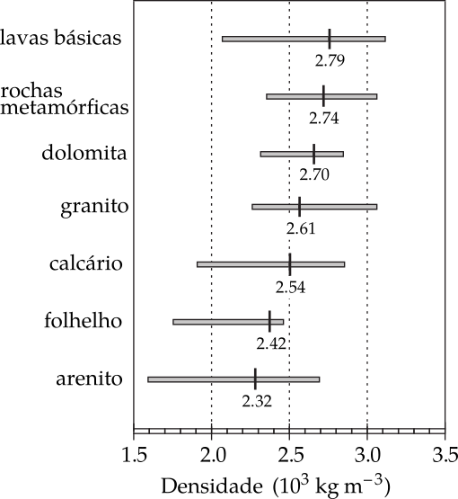
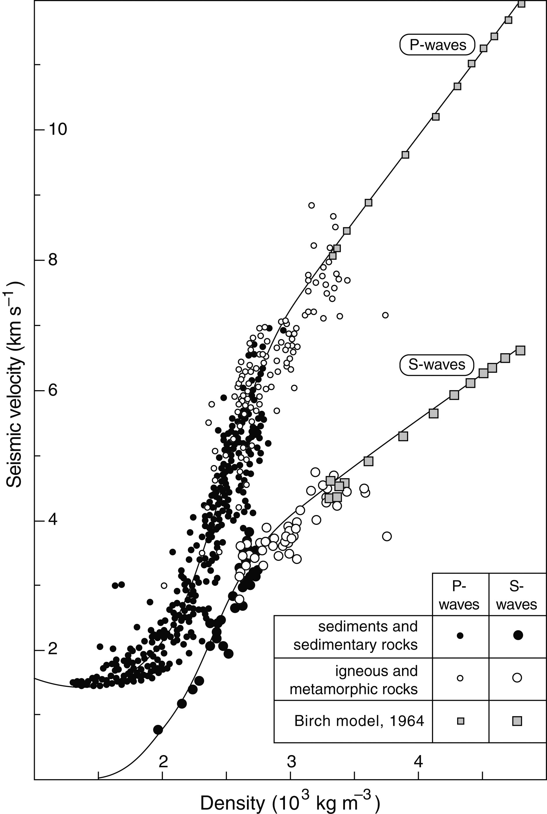
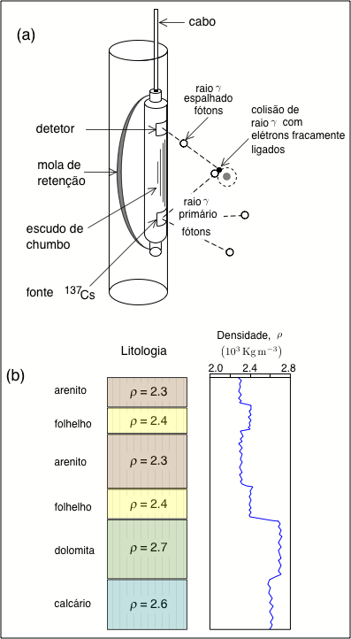
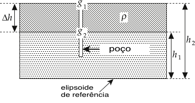
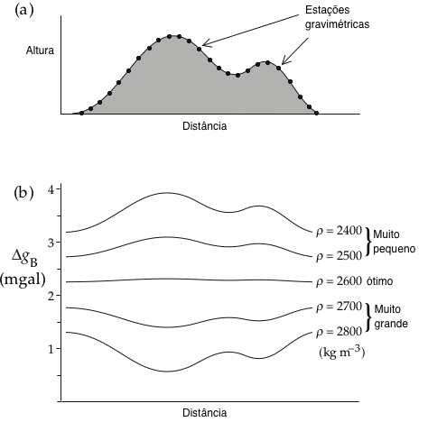

Densidade das Rochas
--------------------

A densidade de rochas na vizinhança de um perfil de gravidade é importante para o cálculo da placa Bouguer e das correções do terreno. Densidade é definida como a massa por unidade de volume de um material. Ela tem diferentes unidades e diferentes valores numéricos no c.g.s. e sistemas SI. Por exemplo, a densidade da água é de :math:`1\; \mathrm{g} \mathrm{cm}^{-3}` no sistema c.g.s., mas :math:`1000\; \mathrm{kgm}^{-3}` no sistema SI. Na prospecção por gravidade unidades como c.g.s.  ainda estão em uso comum, mas estão sendo lentamente substituídas por unidades do SI. As fórmulas dadas para :math:`\Delta g_{\mathrm{T}}` e :math:`\Delta g_{\mathrm{BP}}` nas Equações  :eq:`eq:0241` e :eq:`eq:0243`, respectivamente, exigem que a densidade seja dada em 
:math:`\mathrm{kg}\, \mathrm{m}^{-3}`.

Uma maneira simples de determinar a densidade apropriada para usar em um estudo de gravidade é fazer uma coleção representativa de amostras de rochas com o auxílio de um mapa geológico. A gravidade específica de uma amostra pode ser encontrada diretamente pesando-a primeiro no ar e depois na água, e aplicando o princípio de Arquimedes. Isto dá sua densidade 
:math:`\rho_\mathrm{r}` em relação à da água:

.. math::
    \rho_{\mathrm{r}}=\frac{W_{\mathrm{a}}}{W_{\mathrm{a}}-W_{\mathrm{w}}}
    :label: eq:0245

Tipicamente, as densidades encontradas para diferentes tipos de rochas por este método mostram uma grande quantidade de dispersão sobre suas médias, e as faixas de valores para diferentes tipos de rochas se sobrepõem (:numref:`densidade`). As densidades das rochas ígneas e metamórficas são geralmente mais altas que as das rochas sedimentares. Este método é adequado para o reconhecimento de uma área. Infelizmente, muitas vezes é difícil garantir que a coleção superficial de rochas seja representativa dos tipos de rochas em estruturas subsuperficiais, de modo que métodos alternativos de determinação da densidade apropriada são geralmente empregados. A densidade pode ser medida em furos verticais, perfurados para explorar a natureza de uma estrutura presumida. A densidade determinada no poço é usada para refinar a interpretação da estrutura.

    
    Valores médios típicos e intervalos de densidade para alguns tipos de rochas mais comuns.
    

Densidade a partir de Velocidades Sísmicas
==========================================

Medições em amostras de sedimentos saturados de água e rochas sedimentares, e em rochas ígneas e metamórficas, mostram que a densidade e as velocidades da ondas sísmicas P e S estão relacionadas. O ajuste ideal para cada conjunto de dados é uma curva suave (:numref:`densidadePS`). Cada curva é idealizada, pois os dados reais contêm uma dispersão considerável. Por esta razão, as curvas são mais adequadas para calcular a densidade média de um corpo crustal grande a partir da sua velocidade sísmica média. Devem ser feitos ajustes para as temperaturas e pressões mais altas em profundidade na Terra, que afetam tanto a densidade quanto os parâmetros elásticos das rochas. No entanto, os efeitos de alta pressão e temperatura só podem ser examinados em experimentos de laboratório em amostras pequenas. 
Não se sabe até que ponto os resultados são representativos da relação velocidade-densidade in situ em grandes blocos crustais.

    Relações empíricas entre a densidade e as velocidades das ondas sísmicas P e S
    em sedimentos saturados de água e rochas sedimentares, rochas ígneas e metamórficas.

As curvas velocidade-densidade são relações empíricas que não possuem base teórica. Os dados da onda P são usados mais comumente. Em conjunto com estudos de refração sísmica, eles foram usados para modelar as distribuições de densidade na crosta terrestre e do manto superior responsável por anomalias de gravidade regional em larga escala.

Perfil de Raio Gama
===================

A densidade das formações rochosas adjacentes a um poço pode ser determinada a partir de um instrumento no poço. O princípio faz uso do espalhamento Compton de raios-:math:`\gamma` por elétrons fracamente ligados na rocha adjacente a um poço. Um físico americano, Arthur H. Compton, descobriu em 1923 que a radiação espalhada por elétrons frouxamente ligados experimentava um aumento no comprimento de onda. Essa observação simples não pode ser explicada de maneira alguma se a radiação for tratada como uma onda; a radiação espalhada teria o mesmo comprimento de onda que a radiação incidente. O efeito Compton é facilmente explicado considerando a radiação como partículas ou fótons, ou seja, partículas de energia quantificada, em vez de como ondas. A energia de um fóton é inversamente proporcional ao seu comprimento de onda. A colisão de um fóton de raios-:math:`\gamma` com um elétron é como uma colisão entre bolas de bilhar; parte da energia do fóton é transferida para o elétron. O fóton espalhado tem menor energia e, portanto, um comprimento de onda maior que o fóton incidente. O efeito Compton foi uma importante verificação da teoria quântica.

O perfilador de densidade, ou perfilador *gamma-gamma* (:numref:`gama`), é um dispositivo cilíndrico que contém uma fonte radioativa de raios-:math:`\gamma`, como :math:`^{137}\mathrm{Cs}`, que emite radiação através de uma fenda estreita. Os fótons de raios-:math:`\gamma` colidem com os elétrons de átomos frouxamente ligados próximos ao buraco e são espalhados. Um contador de cintilação para detectar e medir a intensidade dos raios-:math:`\gamma` está localizado na ferramenta a cerca de 45 a 60 cm acima do emissor; a radiação que chega também passa por uma fenda. O emissor e o detector são blindados com chumbo, e a ferramenta é pressionada contra a parede do furo por uma mola forte, de modo que a única radiação registrada é aquela resultante do espalhamento de Compton na formação circundante. A intensidade da radiação detectada é determinada pela densidade dos elétrons e, portanto, pela densidade da rocha próxima à ferramenta de extração. Os raios-:math:`\gamma` penetram apenas cerca de 15 cm na rocha.

    
    O projeto de um dispositivo de um perfil gama-gama para determinar a densidade em um poço (a). 
    Um perfil esquemático gama-gama calibrado em termos da densidade da rocha (b).

Perfis calibrados *gamma-gama* fornecem a densidade aparente da rocha ao redor de um poço. Esta informação é também necessária para calcular a porosidade, que é definida como o volume fracionário da rocha representado por espaços porosos. A maioria das rochas sedimentares é porosa, dependendo a quantidade da quantidade de compactação experimentada. Rochas ígneas e metamórficas geralmente têm baixa porosidade, a menos que tenham sido fraturadas. Normalmente, os poros são preenchidos com ar, gás ou fluido, como água ou óleo. Se as densidades da rocha da matriz e do fluido dos poros são conhecidas, a densidade aparente obtida da extração de *gama-gama* permite que a porosidade da rocha seja determinada.

Gravimetria de Poço
===================

A instrumentação moderna permite que a gravidade seja medida com precisão em poços. Um tipo de gravímetro de poço é uma modificação do instrumento LaCoste – Romberg, adaptado para uso no poço estreito e sob condições de temperatura e pressão elevadas. Instrumentos alternativos foram projetados em diferentes princípios; eles têm uma sensibilidade comparável de cerca de 0.01 mgal. Seu uso para a determinação da densidade do poço é baseado na aplicação das correções de ar livre e da placa Bouguer.

    
    Geometria para cálculo da densidade de uma camada rochosa a partir de medições de gravidade feitas em um poço vertical.

Sejam :math:`g_1` e :math:`g_2` os valores de gravidade medidos em um poço vertical nas alturas :math:`h_1` e :math:`h_2`, respectivamente, acima do elipsoide de referência 
(:numref:`camada`). A diferença entre :math:`g_1` e :math:`g_2` deve-se às diferentes alturas e ao material entre os dois níveis de medição no poó. O valor :math:`g_2` será maior que :math:`g_1` por dois motivos. Primeiro, porque o nível de medição mais baixo está mais próximo do centro da Terra, :math:`g_2` será maior que :math:`g_1` pela quantidade da correção de elevação combinada, nominalmente :math:`(0.3086 - (0.0419\rho \times 10^{-3}))\Delta h` mgal, onde :math:`\Delta h= h_1-h_2`. Em segundo lugar, no nível inferior :math:`h_2`, o gravímetro experimenta uma atração Bouguer ascendente devido ao material entre os dois níveis de medição. Isto reduz a gravidade medida em :math:`h_2` e requer um aumento de compensação para 
:math:`g_2` de quantidade :math:`(0.0419\rho\times 10^{-3})\Delta h` mgal. A diferença entre os valores corrigidos de :math:`g_1` e :math:`g_2` após a redução para o nível :math:`h_2` é então

.. math::
    \begin{align}
     \Delta g &=\left(0.3086-0.0419 \rho \times 10^{-3}\right) \Delta h-0.0419 \rho \times 10^{-3} \Delta h \\ 
              &=\left(0.3086-0.0838 \rho \times 10^{-3}\right) \Delta h
    \end{align}
    :label: eq:0246
    
O rearranjo desta equação fornece a densidade :math:`\rho` do material entre os níveis de medição no poço de sondagem:

.. math::
    \begin{equation}
    \rho=\left(3.683-11.93 \frac{\Delta g}{\Delta h}\right) \times 10^{3} \mathrm{kg} \mathrm{m}^{-3}.
    \end{equation}
    :label: eq:0247

Se as medições da gravidade do poço são feitas com uma precisão de :math:`\pm 0.01\; \mathrm{mgal}` a uma separação de cerca de :math:`10\;\mathrm{m}`, a densidade do material perto do poço pode ser determinada com uma precisão de cerca de :math:`\pm 10\; \mathrm{kg}\,\mathrm{m}^{-3}`. Mais de :math:`90 \%` da variação na gravidade do poço é devido ao material dentro de um raio de cerca de $5\Delta h$ do poço (cerca de :math:`50\,\mathrm{m}` para uma distância :math:`\Delta h \approx 10\mathrm{m}` entre os níveis de medição). Isso é muito maior do que a faixa lateral penetrada pelo perfil gama-gama. Como resultado, os efeitos relacionados ao poço em si não são importantes.

Método de Nettleton para Densidade Próxima da Superfície
=========================================================

A densidade da superfície próxima do material sob uma colina pode ser determinada por um método criado por L. Nettleton que compara a forma de uma anomalia da gravidade Bouguer com a forma da topografia ao longo de um perfil. O método faz uso da correção de elevação combinada :math:`\left(\Delta g_{\mathrm{FA}}+\Delta g_{\mathrm{BP}}\right)` e da correção do terreno 
:math:`\left(\Delta g_{\mathrm{T}}\right)`, que são dependentes da densidade. A correção do terreno é menos importante que a correção da placa Bouguer e geralmente pode ser negligenciada.

    Determinação da densidade de rochas próximas à superfície pelo método de Nettleton. 
    (a) Medições de gravidade são feitas em um perfil através de uma pequena colina. 
    (b) Os dados são corrigidos para elevação com vários valores de teste da densidade. 
    A densidade ótima fornece uma correlação mínima entre a anomalia gravitacional :math:`(\Delta g_{B})` e a topografia.

Um perfil de estações gravitacionais estreitamente espaçadas é medido através de uma pequena colina (:numref:`nettleton`). A correção de elevação combinada é aplicada a cada medição. 
Suponha que a densidade média real da colina seja :math:`2600\; \mathrm{kgm}^{-3}`. Se o valor assumido para :math:`\rho` for muito pequeno :math:`\left(\text{digamos}, 2400\; \mathrm{kg} \mathrm{m}^{-3}\right)`, o valor de :math:`\Delta g_{\mathrm{BP}}` em cada estação será muito pequeno. A discrepância é proporcional à elevação, então a anomalia da gravidade Bouguer é uma imagem positiva da topografia. Se o valor assumido para :math:`\rho` for muito grande :math:`\left(\text{digamos}, 2800\; \mathrm{kg} \mathrm{m}^{-3}\right)`, a situação oposta ocorre. O muito é subtraído em cada ponto, dando uma anomalia computada que é uma imagem negativa da topografia. O valor ótimo para a densidade é encontrado quando a anomalia da gravidade tem correlação mínima com a topografia.

