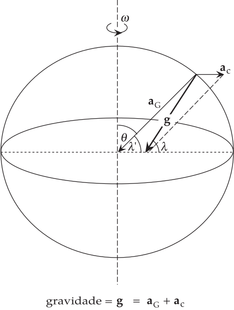

.. _gravidade_terra:

Gravidade e Seu Potencial
-------------------------

O potencial da gravidade :math:`(U_\mathrm{g})` é a soma dos potenciais gravitacional e centrífugo. É frequentemente chamado de geopotencial. 
Em um ponto na superfície do esferóide rotativo, ele pode ser escrito

.. math::
    U_{\mathrm{g}}=U_{\mathrm{G}}-\frac{1}{2} \omega^{2} r^{2} \sin ^{2} \theta
    :label: eq:0227

Se a superfície livre é uma superfície de gravidade equipotencial, então :math:`U_\mathrm{g}` é constante em toda superfície. 
A forma da superfície equipotencial é restrita a ser a do esferoide com aplanamento :math:`f`. Nestas condições, uma relação simples é 
encontrada entre as constantes :math:`f`, :math:`m` e :math:`J_2`:

.. math::
    J_{2}=\frac{1}{3}(2 f-m).
    :label: eq:0228

Pelas Equações  :eq:`eq:0226` e  :eq:`eq:0228` e reordenando os termos obtemos a seguinte relação

.. math::
    \frac{C-A}{E R^{2}}=\frac{1}{3}(2 f-m).
    :label: eq:0229

Isso produz informações úteis sobre a variação de densidade dentro da Terra. As quantidades :math:`f`, :math:`m` e :math:`(C-A)/C` são iguais 
a aproximadamente 1/300. Inserir seus valores na equação fornece :math:`C \approx 0.33ER^2`. Compare este valor com os principais momentos de 
inércia de um casco esférico oco :math:`(0.66ER^2)` e uma esfera sólida com densidade uniforme :math:`(0.4ER^2)`. A concentração de massa perto 
do centro causa uma redução no fator de multiplicação de 0.66 para 0.4. O valor de 0.33 para a Terra implica que, em comparação com uma esfera sólida uniforme, 
a densidade deve aumentar em direção ao centro da Terra.

A Gravidade Normal
------------------

A direção da gravidade em um ponto é definida como perpendicular à superfície equipotencial através do ponto. 
Isso define a *vertical* no ponto, enquanto o plano tangencial à superfície equipotencial define a *horizontal* 
(:numref:`elipsoide`). Uma consequência da forma esferoidal da Terra é que a direção vertical geralmente não é radial, 
exceto no equador e nos polos.

Em uma Terra esférica, não há ambiguidade na forma como definimos a latitude. É o ângulo no centro da Terra entre o raio e o equador, o complemento ao ângulo polar 
:math:`\theta`. Isso define a latitude geocêntrica :math:`\lambda'`. No entanto, a latitude geográfica em uso comum não é definida dessa maneira. 
É encontrada pela medição geodésica do ângulo de elevação de uma estrela fixa acima do horizonte. Mas o plano horizontal é tangencial ao elipsoide, não a uma esfera 
(:numref:`elipsoide`), e a direção vertical (isto é, a direção local da gravidade) intercepta o equador em um ângulo :math:`\lambda` que é ligeiramente maior que a 
latitude geocêntrica :math:`\lambda'` (:numref:`elipsoide4`). A diferença :math:`(\lambda-\lambda')` é zero no equador e nos polos e atinge um máximo numa latitude 
de :math:`45^\circ` onde é apenas :math:`0.19^\circ` (em torno de :math:`12'`).

O *elipsoide de Referência Internacional* é a referência padronizada da figura da Terra. O valor teórico da gravidade no elipsoide rotativo pode ser calculada diferenciando o potencial de gravidade (Equação :eq:`eq:0227`). Este produz os componentes radiais e transversais da gravidade, que são então combinados para dar a seguinte fórmula para a gravidade normal ao elipsoide:

.. math::
    g_{\mathrm{n}}=g_{\mathrm{e}}\left(1+\beta_{1} \sin ^{2} \lambda+\beta_{2} \sin ^{2} 2 \lambda\right)
    :label: eq:0230
 
onde, para a segunda ordem em :math:`f` e :math:`m`,

.. math::
    \begin{align}
    g_{\mathrm{n}}&=g_{\mathrm{e}}\left(1+f-\frac{3}{2} m+f^{2}-\frac{27}{14} f \mathrm{m}\right) \nonumber \\
    \beta_{1} &=\frac{5}{2} m-f+\frac{15}{4} m^{2}-\frac{17}{14} \mathrm{fm} \nonumber \\
    \beta_{2} &=\frac{1}{8} f^{2}-\frac{5}{8} \mathrm{fm} \nonumber
    \end{align}
    :label: eq:0231

    
    A gravidade na terra elipsoidal é a soma vetorial das acelerações gravitacional e centrífuga e não é radial; consequentemente, 
    a latitude geográfica :math:`(\lambda)` ligeiramente maior que geocêntrica latitude :math:`(\lambda')`.

A Equação :eq:`eq:0230` é conhecida como a fórmula de gravidade normal. As constantes na fórmula, definidas em 1980 para o *Sistema de Referência Geodésico (GRS80)* ainda em uso comum, são: :math:`g_e= 9.780327\, \text{m}\text{s}^{-2}`; :math:`\beta_1=5.30244\times 10^{-3}`; :math:`\beta_2 = -5.8\times 10^{-6}`. Eles permitem o cálculo da gravidade normal em qualquer latitude com uma precisão de 0.1 mgal. Instrumentos modernos podem medir diferenças de gravidade com precisão ainda maior, neste caso uma fórmula mais exata, com precisão de :math:`0.0001` mgal, 
pode ser usada. A fórmula da gravidade normal é muito importante na análise das medidas de gravidade na Terra, porque fornece a variação teórica da gravidade normal :math:`(g_n)` com a latitude na superfície do elipsoide de referência.

A gravidade normal é expressa em termos de :math:`g_e`, o valor da gravidade no equador. Os termos de segunda ordem :math:`f^2`, :math:`m^2` e :math:`fm` são cerca de 300 vezes menores que os termos de primeira ordem :math:`f` e :math:`m`. A constante :math:`\beta_2` é cerca de 1000 vezes menor que :math:`\beta_1`. Se descartarmos termos de segunda ordem e usarmos 
:math:`\lambda = 90^\circ`, o valor da gravidade normal no polo é :math:`g_p= g_e (1+\beta_1)`, então, reorganizando e retendo apenas termos de primeira ordem, obtemos

.. math::
    \frac{g_{\mathrm{p}}-g_{\mathrm{e}}}{g_{\mathrm{e}}}=\frac{5}{2} m-f
    :label: eq:0232

Essa expressão é chamada de teorema de Clairaut. Ela foi desenvolvido em 1743 por um matemático francês, Alexis-Claude Clairaut, que foi o primeiro a relacionar a variação da gravidade na Terra em rotação com o achatamento do esferoide. A fórmula de gravidade normal dá :math:`g_p=9.832186\,\text{m}\text{s}^{-2}`. Numericamente, isso dá um aumento na gravidade do equador ao polo de aproximadamente :math:`5.186 \times 10^{-2} \mathrm{m} \mathrm{s}^{-2}` ou 518 mgal.
10 2 m s 2 ou 5186 mgal.

Há duas razões óbvias para o aumento da gravidade no polo. A distância ao centro de massa da Terra é menor nos polos do que no equador. Isto dá uma aceleração gravitacional mais forte 
:math:`(a_\mathrm{G})` nos polos. A diferença é

.. math::
    \Delta a_{\mathrm{G}}=\left(\frac{G E}{c^{2}}-\frac{G E}{a^{2}}\right).
    :label: eq:0233

Isto dá um excesso de gravidade de aproximadamente 6600 mgal nos polos. O efeito da força centrífuga na gravidade decrescente é maior no equador, onde é igual a :math:`(\mu a_G)` 
e é zero nos polos. Isso também resulta em um aumento da gravidade em direção ao polo, chegando a 3375 mgal. Estas figuras indicam que a gravidade deve aumentar em um total de 
9975 mgal do equador ao polo, em vez da diferença observada de 5186 mgal. A discrepância pode ser resolvida levando-se em conta um terceiro fator. O cálculo da diferença na atração gravitacional não é tão simples como indicado pela :eq:`eq:0233`. O bojo equatorial coloca um excesso de massa sob o equador, aumentando a atração gravitacional equatorial e reduzindo a diminuição da gravidade do equador para o polo.

