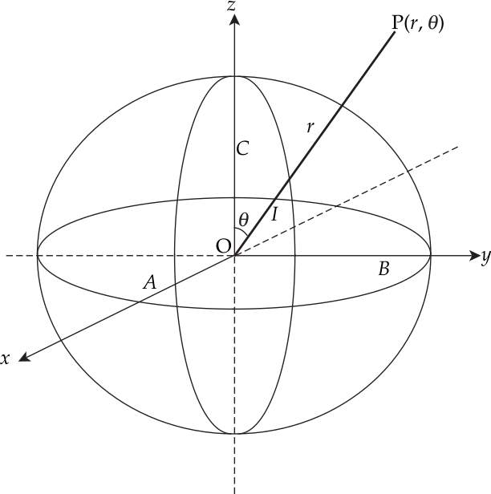
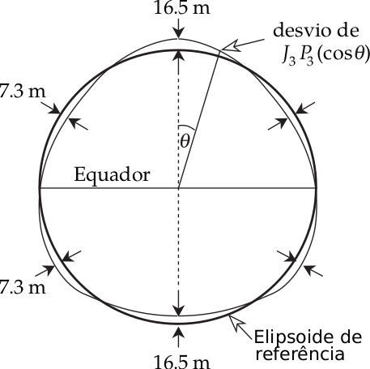
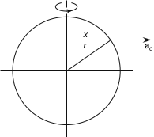

.. _potencial_terra:

Potencial Gravitacional da Terra Esferoidal
-------------------------------------------

A forma elipsoidal muda o potencial gravitacional da Terra de uma esfera não deformada. Em 1849, J. MacCullagh desenvolveu a seguinte fórmula para o potencial gravitacional de qualquer corpo a grande distância de seu centro de massa:

.. math::
    U_{\mathrm{G}}=-G \frac{E}{r}-G \frac{(A+B+C-3 I)}{2 r^{3}}-\cdots
    :label: pot_MacCullagh

O primeiro termo, de ordem :math:`r^{-1}`, é o potencial gravitacional de um ponto de massa ou esfera com massa :math:`E` (Equações :eq:`potencialU` e 
:eq:`Pot_E`); para a Terra ela descreve o potencial do globo não deformado. Se os eixos de referência estão centrados no centro de massa do corpo, 
não há termo em :math:`r^{-2}`. O segundo termo, da ordem :math:`r^{-3}`, é devido aos desvios da forma esférica. Para a Terra aplainada ela é resultante 
dos deslocamentos de massa devido à deformação rotacional. Os parâmetros :math:`A`, :math:`B` e :math:`C` são os principais momentos de inércia do corpo 
e :math:`I` é o momento de inércia em torno da linha :math:`OP` que une o centro de massa ao ponto de observação (:numref:`elipsoide2`). 
Para expressar o potencial com precisão, é necessário um número infinito de termos de ordem superior em :math:`r`. No caso da Terra, estes podem ser negligenciados, porque o próximo termo é cerca de 1000 vezes menor que o segundo termo.

    
    Parâmetros do elipsoide usado pela fórmula de MacCullagh. :math:`A`, :math:`B` e :math:`C` são momentos de 
    inércias em torno dos eixos :math:`x-`, :math:`y-` e :math:`z-` respectivamente, e :math:`I` 
    é o momento de inércia em torno da linha :math:`OP`.
    
Para um corpo com planos de simetria, :math:`I` é uma simples combinação dos principais momentos de inércia. Configurando :math:`A` igual a :math:`B` 
para simetria rotacional, e definindo o ângulo entre :math:`OP` e o eixo de rotação sendo :math:`\theta`, a expressão para :math:`I` é

.. math::
    I=A \sin ^{2} \theta+C \cos ^{2} \theta
    :label: eq:0221

A fórmula de MacCullagh para a Terra elipsoidal então torna-se

.. math::
    U_{\mathrm{G}}=-G \frac{E}{r}+G \frac{(C-A)\left(3 \cos ^{2} \theta - 1\right)}{2 r^{3}}
    :label: eq:0222
    
    
    
A função :math:`\left(3 \cos ^{2} \theta - 1\right) / 2` é um polinômio de segunda ordem em :math:`\cos\theta`, e escrevemos como 
:math:`P_2(\cos\theta)`. Ele pertence a uma família de funções chamadas de polinômios de Legendre. Usando esta notação a fórmula de MacCullagh para o potencial gravitacional do elipsoide oblato torna-se

.. math::
    U_{G}=-G \frac{E}{r}+G \frac{(C-A)}{r^{3}} P_{2}(\cos \theta).
    :label: eq:0223

Esta pode ser escrita na forma alternativa

.. math::
    U_{\mathrm{G}}=-G \frac{E}{r}\left(1-\left(\frac{C-A}{E R^{2}}\right)\left(\frac{R}{r}\right)^{2} P_{2}(\cos \theta)\right).
    :label: eq:0224

A Equação :eq:`eq:0224` é uma aproximação para o potencial de um elipsoide. Para uma maior precisão precisamos de uma matemática um pouco mais avançada, é o que veremos a seguir.

A teoria do potencial requer que o potencial gravitacional da Terra esferoidal deva satisfazer uma importante equação, a equação de Laplace: 
:math:`\nabla^2U_\mathrm{G}`. A solução dessa equação é a soma de um número infinito de termos de ordem crescente em :math:`1/r`, cada um envolvendo um polinômio de Legendre apropriado e ela é dada por:

.. math::
    U_{\mathrm{G}}=-G \frac{E}{r}\left(1-\sum_{n=2}^{\infty}\left(\frac{R}{r}\right)^{n} J_{n} P_{n}(\cos \theta)\right)
    :label: eq:0225

Nesta equação, os coeficientes :math:`J_n` multiplicando :math:`P_n(\cos\theta)` determinam a importância relativa do termo de enésima ordem. 
Os valores de :math:`J_n` são obtidos a partir da geodésia do satélite: :math:`J_2= 1082.6\times 10^{-6}`; :math:`J_3= -2.54\times 10^{-6}`; 
:math:`J_4=-1.59\times 10^{-6}`; ordens mais altas são insignificantes. O coeficiente mais importante é o de segunda ordem, o  fator forma dinâmica 
:math:`J_2`, que descreve o efeito do achatamento polar no potencial gravitacional da Terra. Uma comparação dos termos das Equações. :eq:`eq:0224` e :eq:`eq:0225`  dá o resultado

.. math::
    J_{2}=\frac{C-A}{E R^{2}}.
    :label: eq:0226
    
O termo de próxima ordem superior :math:`(n=3)` na Equação :eq:`eq:0225` descreve os desvios do elipsoide de referência que correspondem a uma Terra em forma de pera 
(:numref:`elipsoide3`). Estes desvios são da ordem de :math:`7-17` m, mil vezes menores que os desvios do elipsoide de um esfera, que são da ordem de :math:`7-14` km.

    
    O termo de terceira ordem no potencial gravitacional descreve uma Terra em forma de pera. 
    Os desvios do elipsoide de referência são da ordem de 10 a 20 m, muito menores que os desvios do elipsoide de uma esfera, 
    que são da ordem de 7 a 14 km.

O Potencial Centrífugo
----------------------

A aceleração centrífuga é o gradiente do potencial centrífugo :math:`U_\mathrm{c}`,

.. math::
    \mathbf{a}_{\mathrm{c}}=-\nabla U_{\mathrm{c}}
    
Seja :math:`x` a distância perpendicular do eixo de rotação a um ponto na superfície na latitude :math:`\theta` e seja :math:`\omega` 
a taxa angular de rotação da Terra (:numref:`centrifugo`). A aceleração centrífuga é igual a :math:`\omega^2 x`, portanto, 
para uma taxa constante de rotação, :math:`U_\mathrm{c}` varia apenas com :math:`x`. Assim sendo

.. math::
    \omega^{2} x=-\frac{\partial U_{\mathrm{c}}}{\partial x}

    
    Aceleração centrífuga :math:`\mathbf{a}_{\mathrm{c}}` em co-latitude :math:`\theta` direcionada perpendicularmente para fora do eixo de rotação.

integrando ambos os lados em relação a :math:`x` teremos

.. math::
    U_{\mathrm{c}}=-\frac{1}{2} \omega^{2} x^{2}+U_{0}

O potencial é zero no eixo de rotação, onde :math:`x = 0` e a constante de integração :math:`U_\mathrm{c} = 0`. 
A equação para o potencial centrífugo em termos de ângulo polar :math:`\theta` é

.. math::
    U_{\mathrm{c}}=-\frac{1}{2} \omega^{2} x^{2}=-\frac{1}{2} \omega^{2} r^{2} \sin ^{2} \theta

