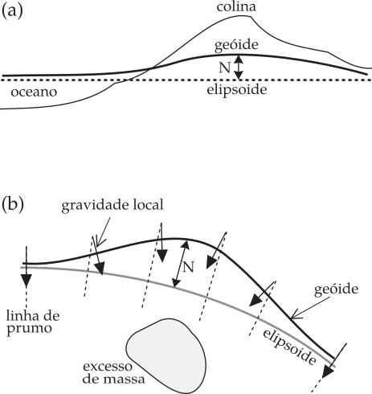
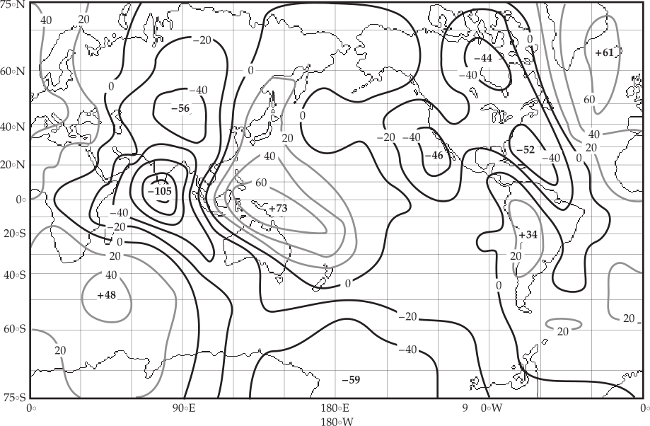

O Geóide
--------

O elipsóide de referência internacional é uma aproximação da superfície equipotencial da gravidade, mas é realmente uma conveniência matemática. A superfície física equipotencial da gravidade é chamada de geóide. Ele reflete a verdadeira distribuição de massa dentro da Terra e difere do elipsóide teórico por pequenas quantidades. Longe da Terra o geóide concorda com a superfície livre do oceano, excluindo os efeitos perturbadores temporários das marés e ventos. Nos continentes, o geóide é afetado pela massa de terra acima do nível médio do mar 
(:numref:`massa` a). A massa dentro do elipsóide causa uma atração gravitacional descendente em direção ao centro da Terra, mas uma colina ou montanha cujo centro de gravidade está fora do elipsóide causa uma atração ascendente. Isso causa uma elevação local do geóide acima do elipsóide. O deslocamento entre o geóide e o elipsóide é chamado de ondulação geoidal; a elevação causada pela massa acima do elipsóide é uma ondulação positiva.

    
    (a) Uma massa fora do elipsóide ou (b) um excesso de massa abaixo do elipsóide eleva o geóide acima do elipsóide. 
    N é a ondulação do geóide. 
    

Ondulações do Geoide
--------------------

Ao computar a figura teórica da Terra, a distribuição de massa abaixo do elipsóide é assumido como homogêneo. Um excesso local de massa sob o elipsóide irá desviar e fortalecer a gravidade localmente. O potencial do elipsóide é alcançado mais longe do centro da Terra. A superfície equipotencial é forçada a se inclinar para cima enquanto permanece normal à gravidade. Isto dá uma ondulação geóide positiva sobre um excesso de massa sob o elipsóide (:numref:`massa` b). Por outro lado, um déficit de massa abaixo do elipsóide irá desviar o geóide abaixo do elipsóide, causando uma ondulação geoidal negativa. Como resultado da topografia irregular e da distribuição de massa interna heterogênea da Terra, o geóide é uma superfície equipotencial acidentada.

O potencial do geóide é representado matematicamente por **funções harmônicas esféricas** que envolvem os **polinômios associados de Legendre**. Estes são mais complicados que os polinômios comuns de Legendre usados para descrever o potencial gravitacional do elipsóide (Equações. :eq:`eq:0223` - :eq:`eq:0225`). Até agora só consideramos variação do potencial com distância :math:`r` e com o ângulo de colatitude :math:`\theta`. Isso é uma simplificação excessiva, porque as variações de densidade dentro da Terra não são simétricas em relação ao eixo de rotação. O geóide é uma superfície equipotencial para a distribuição da densidade real na Terra, e assim o potencial do geóide varia com a longitude e com a co-latitude. Essas variações são consideradas expressando o potencial como soma das funções harmônicas esféricas, conforme descrito. Esta representação do geopotencial é análoga à expressão mais simples do potencial gravitacional da Terra rotacionalmente simétrica usando uma série de polinômios de Legendre (Equação :eq:`eq:0225`).

Em análises modernas, o coeficiente de cada termo no geopotencial - semelhante aos coeficientes :math:`J_n` na Equação :eq:`eq:0225` - pode ser calculado até um alto grau harmônico. Os termos até um grau selecionado são então usados para calcular um modelo do geóide e do campo de gravidade da Terra. Uma combinação de dados de satélite e medidas de gravidade da superfície foi usada para construir o Modelo da Terra Goddard - Goddard Earth Model (GEM)10. Uma comparação global entre um elipsóide de referência com o aplanamento :math:`1/298.257` e a superfície geóide calculada a partir do modelo GEM 10 mostra ondulações geoidais de longo comprimento de onda (:numref:`ondulacao`). A maior ondulação negativa (-105 m) está no Oceano Índico, ao sul da Índia, e a maior ondulação positiva (+73 m) está no Oceano Pacífico equatorial, ao norte da Austrália. Essas características de grande escala são muito amplas para serem atribuídas a anomalias de massa crostais ou litosféricas. Eles são pensados serem devido a heterogeneidades que se estendem profundamente no manto inferior, mas sua origem ainda não é compreendida.

    
    Mapa mundi das ondulações geoidais relativas a um elipsóide de referência de aplanamento :math:`f= 1/298.257`. 
    
    
